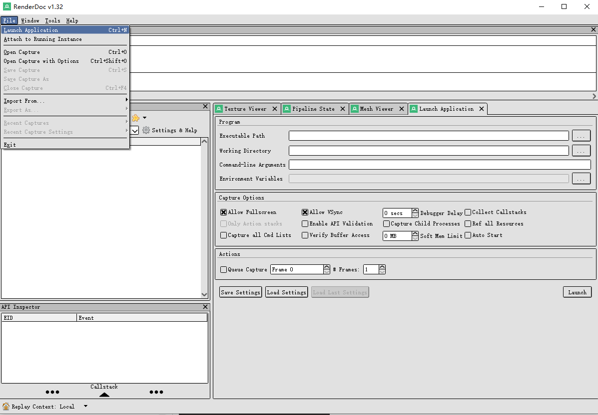
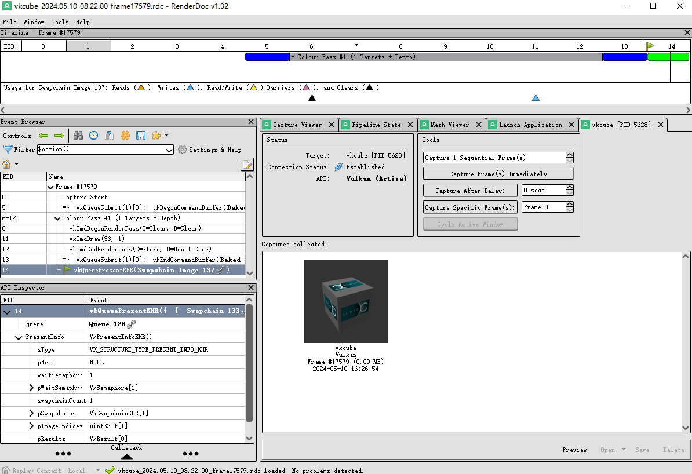
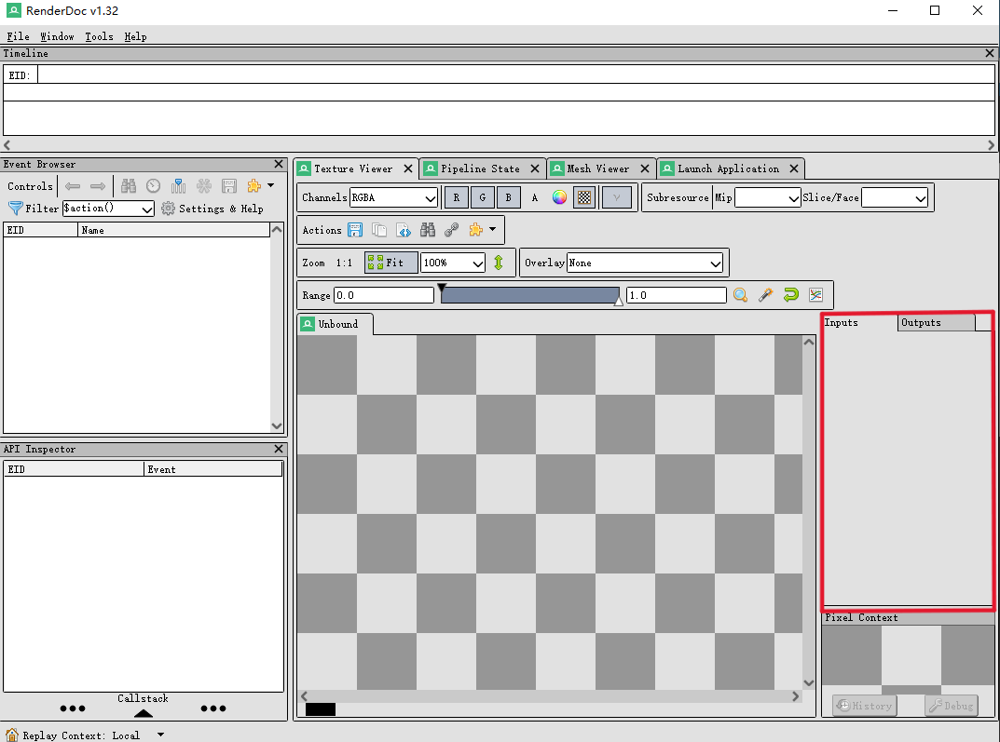
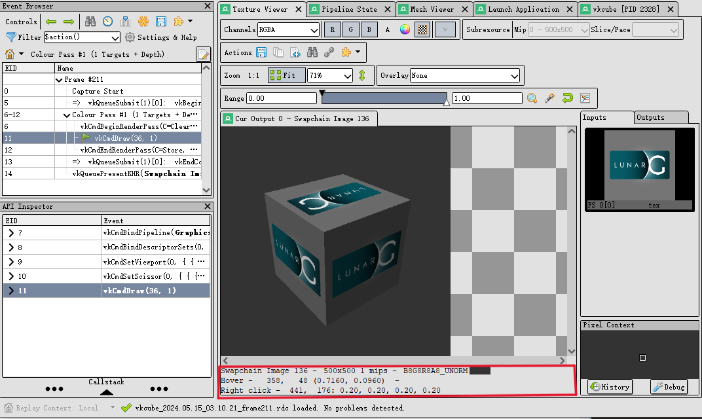
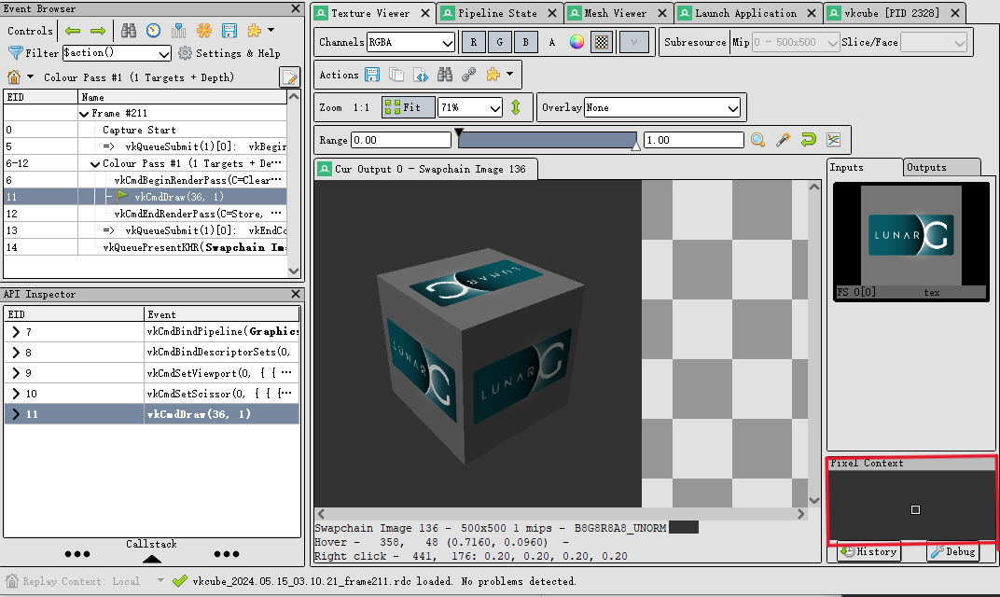
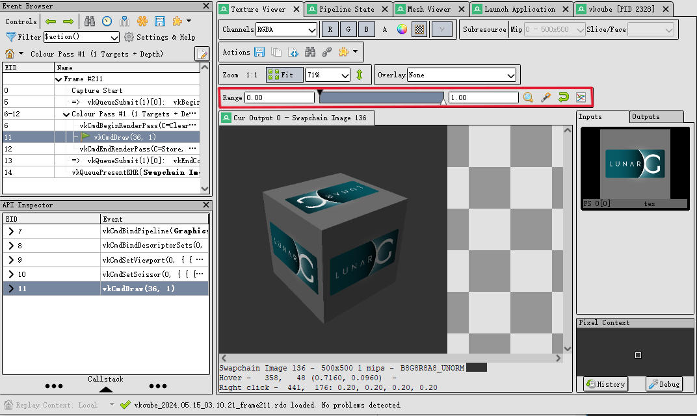
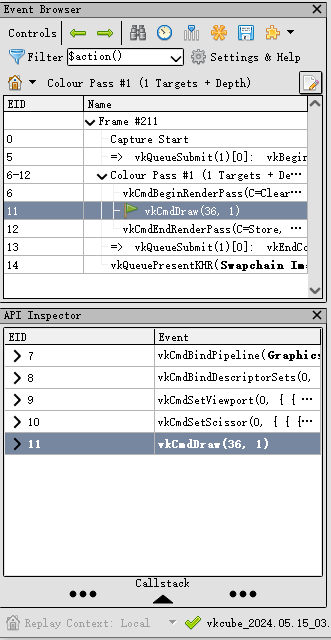
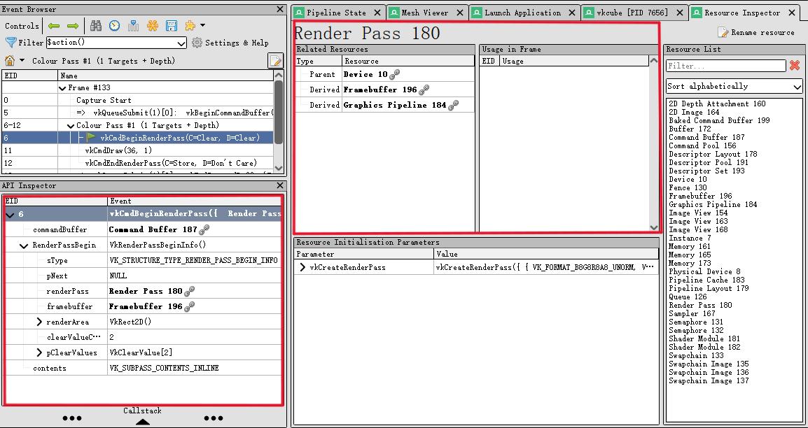
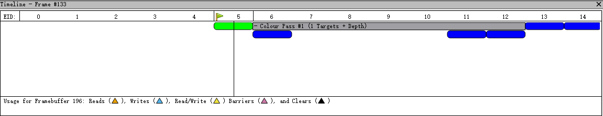
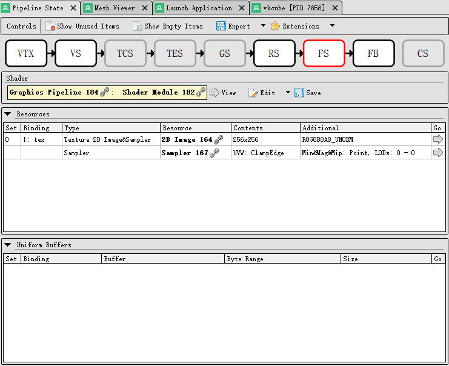

# Quick Start 
要捕捉一个帧，请首先选择 文件(File)→ 启动应用程序（Launch Application）。默认情况下，这将打开一个新的停靠窗口，在这里你可以配置捕捉时将使用的不同设置。你可能会发现这个窗口已经可用。

 

默认设置在大多数情况下都能很好地工作，因此你可以直接浏览或拖拽你的可执行文件（exe）到可执行文件框中。如果工作目录框为空，则会使用可执行文件的目录。输入你可能需要的任何命令行参数，然后点击启动（Launch），以使用 RenderDoc 启动应用程序。

 

从上图中，我们能看到RenderDoc的界面分成很多区块，我们将一一展开讲解。
## RenderDoc layout

### Texture Viewer
在RenderDoc中，Texture Viewer是一个非常重要的工具窗口，它允许用户查看和分析捕获帧中使用的纹理资源。这个窗口提供了丰富的功能，可以帮助开发者更深入地理解和调试图形应用中的纹理处理。我们将挑选其中最主要的几个功能进行重点介绍。
1. __Thumbnail Strip__ 

 

Thumbnail Strip展示了一系列缩略图，每个缩略图代表一次绘制调用的结果。用户可以通过滚动和点击这些缩略图来选择并查看特定的绘制调用。
* __输入（Input）__ 
输入通常是指每个绘制调用之前使用的资源和状态，包括纹理、缓冲区、着色器等。
* __查看方法：__ 
* * 在Thumbnail Strip中，选择一个绘制调用后，可以在Texture Viewer或其他相关窗口中查看其输入资源。例如，点击缩略图会更新相应窗口，显示此绘制调用所使用的输入纹理、顶点缓冲区和其他资源。
* * 这些输入资源的信息通常可以通过RenderDoc的资源浏览器（Resource Inspector）来进一步查看，提供详细的资源属性和状态。
* __输出（Output）__ 
输出是指绘制调用完成后在目标缓冲区（如帧缓冲区）中生成的图像或数据。
* __查看方法：__ 
* * 在Thumbnail Strip中，每个缩略图展示的是绘制调用的最终输出结果。这些缩略图可以快速帮助用户理解每个调用对最终帧的贡献。
* * 选择一个缩略图后，Texture Viewer会显示相应的输出图像，允许用户检查像素级别的细节和输出效果。
 

* __实际操作步骤__ 
a. 启动RenderDoc并捕获帧 
b. 打开Texture Viewer和Thumbnail Strip 
c. 浏览和选择缩略图 
d. 查看输入资源 
 

* __应用场景__
* * 调试渲染问题：快速定位和分析渲染管线中的每一步，找出可能的渲染错误或问题。
* * 性能优化：通过观察每个绘制调用的输入和输出，识别哪些调用影响性能并进行优化。
* * 视觉效果验证：确保每个绘制调用的结果符合预期，逐步检查复杂场景中的渲染效果。
 

2. __Status Bar__ 

 
纹理的格式和尺寸显示在纹理显示下方的状态栏中。同样在此状态栏上，您可以看到当前鼠标悬停的像素坐标，以及右键点击纹理显示任意位置后可以检查的“拾取”像素值。

3. __pixel_context__ 

 
此外，在纹理查看器窗口的右下角，有一个小的放大区域，显示了最后拾取像素周围的上下文。从这里，您还可以启动像素历史或调试器。

4. __Range__ 

 
最后，我们要强调的是范围控制工具。这个工具非常灵活，可以让您调整图像的可见范围。在查看超出 [0, 1] 范围的 HDR 图像时尤其有用。使用范围控制工具时，您可以拖动白点和黑点进行微调，或者输入数值来改变白点和黑点的值（默认值分别是0和1）。

### Event Browser

在RenderDoc中，Event Browser（事件浏览器）是一个重要的工具窗口，用于查看和导航捕获帧中的所有图形事件（如绘制调用、状态改变、资源绑定等）。事件浏览器提供了详细的调用序列，使用户能够深入分析每个图形操作对最终渲染结果的影响。其中第一列EID表示事件或API调用在帧中的时间顺序。

 

在RenderDoc的Event Browser（事件浏览器）中，Controls工具栏提供了一系列实用的控件，帮助用户更高效地浏览和分析捕获的帧。Controls工具栏位于事件浏览器窗口的顶部，包含各种按钮和选项，用于控制事件列表的显示和操作。通过这些控件，用户可以自定义视图、过滤事件、导航事件列表以及调整显示选项。
1. __Filter（过滤字）：__
允许用户输入关键字或条件来过滤显示的事件。只显示符合过滤条件的事件。用于快速定位特定类型的事件或特定的绘制调用，减少需要手动浏览的事件数量。
2. __Select Visible Columns（选择可见列）：__
允许用户选择哪些列在事件列表中可见，并可以调整列的顺序。根据需要自定义显示的列，以更好地查看和分析感兴趣的数据。
3. __Find Event by String（通过字符串查找事件）：__
允许用户输入特定的字符串来查找事件列表中匹配的事件。快速定位包含特定关键词的事件或API调用，提升分析效率。
4. __Time Durations for Actions（动作的时间持续）:__
显示每个绘制调用或动作的时间持续，帮助分析渲染性能。识别和优化耗时较长的绘制调用或状态改变，提升应用性能。
5. __Toggle Bookmark（切换书签）：__
添加或移除事件的书签，用于标记重要或感兴趣的事件。在复杂的捕获中快速标记和找到关键事件，方便后续分析。
6. __Export the List of Events to Disk（导出事件列表到磁盘）：__
将当前事件列表导出为文件，保存到磁盘。保存和分享捕获的事件列表，便于离线分析或与团队成员协作。
7. __Extensions Command（扩展命令）：__
执行由用户配置的扩展命令，以扩展RenderDoc的功能。通过自定义命令扩展RenderDoc的功能，满足特定的调试和分析需求。
 

在RenderDoc的Event Browser中，当前事件（即我们正在检查图形状态的事件）用绿色旗标（flag_green）标记，并且整行高亮显示。当选择任意一行时，该行会立即成为新的当前事件。

### API Inspector

在RenderDoc中，API Inspector（API检查器）是一个重要的工具窗口，用于查看捕获帧中每个图形API调用的详细信息。它提供了每个调用的参数、返回值以及调用堆栈的详细视图，使开发者能够深入分析和调试图形渲染问题。

 
API Calls窗口会在选择新的事件时更新，显示各个API调用及其参数。如果选择了一个动作（action），列表将显示从前一个动作到当前动作之间的所有API调用，并且列表中的最后一项始终对应当前动作本身。每一行都可以展开，显示传递给该API调用的参数。

窗口底部有一个可选的可展开部分，显示从应用程序代码调用到API函数的调用堆栈（如果可用并已记录）。

### Timeline Bar

Timeline Bar显示了捕获帧中所有事件和操作的时间顺序和持续时间，帮助用户快速识别和定位渲染过程中的关键事件。通过时间轴，用户可以更方便地浏览复杂的渲染帧，并查看每个事件的具体时刻和持续时间。

 

__主要特点:__
1. 帧标记层次结构：
* 时间轴栏显示帧标记层次结构，采用自上而下的方式排列。用户可以通过点击每个部分来展开或折叠这些层次结构。
* 每个动作在其所属层次结构部分下方以蓝色标记显示。
2. 当前动作和事件指示：
* 当前动作（如果可见）以绿色圆圈显示。
* 当前动作周围有一条垂直线，上方有一个绿色旗标（flag_green），鼠标悬停的事件周围有灰色轮廓。
3. 纹理使用标记：
* 当当前选定的纹理在帧中被使用时，每个引用该纹理的动作都会在时间轴下方绘制一个标记
* 不同颜色的标记表示动作对纹理的不同操作，例如写入、读取或同时读写等。
* 如果标记过于接近，它们会自动调整间距以保持可读性，必要时可以通过放大来对齐特定的动作。

### Pipeline State

在RenderDoc中，Pipeline State（管线状态）窗口是一个强大的工具，用于查看和分析图形渲染管线的当前状态。它提供了有关GPU渲染管线各个阶段的详细信息，包括输入装配、顶点着色器、片段着色器、光栅化器、输出合并等。通过Pipeline State窗口，开发者可以深入了解每个渲染阶段的配置和状态，从而有效地调试和优化渲染过程。

 

Pipeline State窗口展示了捕获帧中当前选定事件的完整渲染管线状态。它详细列出了从输入装配到输出合并的各个阶段，并显示了每个阶段的资源绑定、状态设置和配置信息。
* __VTX（Vertex Input - 顶点输入）__ 
负责从内存中获取顶点数据，并将其传递给顶点着色器。顶点数据通常包括位置、颜色、法线、纹理坐标等。
* __VS（Vertex Shader - 顶点着色器）__ 
处理每个顶点的数据，对顶点进行变换和光照计算，生成屏幕空间的顶点位置。
* __TCS（Tessellation Control Shader - 曲面细分控制着色器）__ 
控制曲面细分的细节级别。决定如何将顶点细分为更小的片段。
* __TES（Tessellation Evaluation Shader - 曲面细分评估着色器）__ 
评估细分曲面的控制点，并生成新的顶点数据。
* __GS（Geometry Shader - 几何着色器）__ 
处理顶点图元，生成新的图元（如点、线、三角形），或者对现有图元进行修改。
* __RS（Rasterizer - 光栅化器）__ 
将图元转换为片段（像素）。决定哪些像素在屏幕上显示以及如何进行深度和模板测试。
* __FS（Fragment Shader/Pixel Shader - 片段着色器/像素着色器）__ 
计算每个片段的颜色值。执行纹理采样、光照计算、颜色混合等操作。
* __FB（Framebuffer - 帧缓冲区）__ 
存储渲染的最终输出图像。包含颜色缓冲区、深度缓冲区和模板缓冲区。
* __CS（Compute Shader - 计算着色器）__ 
用于通用计算任务，而不仅限于图形渲染。能够并行处理大量数据。
 

默认情况下，管线不会包含空或未使用的条目。例如，如果着色器只读取资源0和1，即使有东西绑定到槽位2，它也不会显示。同样，如果槽位3-128是空的，它们也不会显示。
 

大多数管线阶段的部分可以展开以查看更多详细信息。 
__Shader__：展开后显示着色器源代码/反汇编。 
__Resources__：展开后在纹理查看器中打开该资源的新标签。 
__Uniform Buffers__：展开后在Mesh Viewer窗口、缓冲区的原始视图或包含常量内容的弹出窗口中查看。
 

__API对象链接__：任何提到API对象的地方，其名称都以粗体显示，并带有一个链接。打开资源检查器窗口，详细查看对象的定义及其与其他API对象的链接。
 

__查看未使用和空条目：__ 
__Show Unused Items__：用于调试时查看所有绑定资源，了解是否有未使用但绑定的资源。 
__Show Empty Items__：用于全面检查所有槽位，确保没有遗漏或未初始化的资源。
 

### Mesh Viewer
Mesh Viewer 提供了一个图形化界面，显示捕获帧中选定绘制调用的顶点和索引数据。它可以展示原始顶点数据、变换后的顶点数据以及索引数据，还能查看每个顶点的属性（如位置、法线、纹理坐标等）。

#### 主要功能
1. __数据检查__ 
允许检查几何数据，包括原始数据和经过渲染管线处理后的数据。
2. __多种预览模式__ 
默认情况下，预览显示网格的线框渲染。可以选择不同的可视化方式，包括简单阴影、顶点爆炸工具或使用次要属性作为颜色。右键点击任意列可以选择用于渲染的次要属性。
3. __属性选择__ 
可以选择哪个属性作为顶点的位置属性，以防自动检测失败或需要在3D空间中可视化其他属性（如纹理坐标）。
4. __顶点选择__ 
在网格预览中按住或点击鼠标右键可以选择网格数据表中的顶点。
5. __相机和视图设置__ 
__默认视图__：默认视图为相机位于视点原点，通过视口向外查看。 
__透视矩阵猜测__：输出尝试从输出数据中猜测透视矩阵，但可以通过打开选项（齿轮图标）并输入更准确或修正的值来精细调整或更改为正交视图。
 

#### 应用场景
* __调试几何数据__：通过检查原始和变换后的顶点数据，开发者可以检查和调试几何数据的完整性和正确性。
* __验证渲染输出__：通过不同的可视化方式，开发者可以验证渲染输出，确保每个顶点属性和数据都符合预期。

# [FAQ](https://renderdoc.org/docs/getting_started/faq.html)
## 配置Adb
在cmd.exe中执行adb devices，如果提示adb找不到。需要在“控制面板 > 系统和安全 > 系统”中，打开“高级系统配置 > 高级 > 环境变量”，在path中增加adb.exe 1.0.39 (or later) 的路径。再次在cmd.exe中执行adb devices，直到计算机识别到该设备展示到设备列表中。
