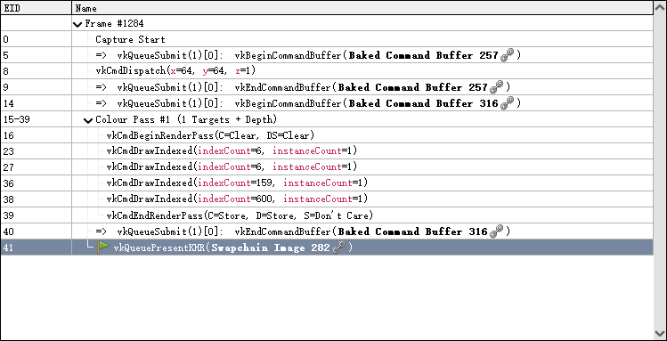
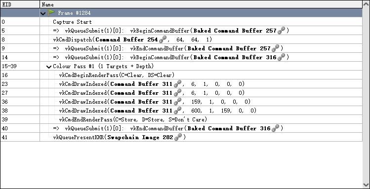

# 事件浏览窗口

Event Browser在应用程序包含用户定义的帧的部分和子部分注释时最为有用，这样可以更逻辑化和有序地浏览帧。通过这些API函数提供的任何标记区域的颜色将用于标记该区域的行，并在树的左侧显示一条条形图，以显示某个事件属于哪些区域。
 

## 过滤显示的事件
默认情况下，Event Browser 仅列出动作（Actions）。动作是指诸如绘制、调度、复制、清除、解析以及其他导致 GPU 工作或影响内存和资源（如纹理和缓冲区）的调用。这些有时被称为绘制调用（drawcall），但使用“动作”一词更不易引起歧义，因为它不仅仅指实际的光栅化绘制。通常，这些是你在浏览帧时需要查看的唯一事件，但有时你可能需要查看一些状态设置调用，以了解状态发生了哪些变化。要做到这一点，可以将事件浏览器中的过滤器从默认设置更改为包含这些状态设置调用。过滤器表达式有一个下拉列表，允许您选择任何预先保存的过滤器，并且您可以在设置窗口中保存新过滤器。
 

## 事件显示
配置过滤器时，可在“设置和帮助”窗口下使用一些控件来调整这些名称。
* Show custom action names：默认开启，用于控制是否在事件浏览器中显示自定义动作名称。这些自定义名称可以帮助开发者更容易地理解和识别复杂的渲染操作，如间接绘制和渲染通道等。
* Show parameter names and values：用于控制是否在事件浏览器或API Inspector中显示每个API调用的参数名称和参数值。

* Show all parameter： 用于控制是否在事件浏览器或API Inspector中显示所有API调用的参数。启用该选项后，开发者可以看到每个API调用的完整参数列表。

 

在Filter和Setting选项栏上还存在这一行Controls工具栏，依次是go to previous action, go to next action, find event, time button, select available columns, bookmark button, save button, extensions。
## Selecting available columns
默认情况下，Event Browser 中的列包括 EID 和 Name。Name 列无法移除，因为它包含了事件树，但其他列可以根据需要进行自定义，以隐藏/显示或重新排序和调整大小

## Time actions
timer button 将自动运行一个过程，获取每个动作的时间，并将其显示在“Duration”列中，如果必要的话，会自动添加该列。
你可以在Tools->Settings->Event Browser中配置“Duration”列使用的时间单位。

## Bookmark
书签按钮将允许您为事件添加书签，快捷键是 Ctrl-B。在事件浏览器顶部的工具栏上会显示一个书签事件列表。使用快捷键 Ctrl-1 到 Ctrl-0 可以跳转到相应的书签事件。

## find event
按下 Ctrl-F 将打开查找事件工具栏。这个工具栏允许你输入部分文本过滤器，该过滤器将与标签和动作事件匹配。当你按下回车键时，将执行查找操作。如果找到的事件位于未展开的部分内，这些部分将自动展开，直到匹配的事件可见。匹配的事件将以查找图标高亮显示，重复按下回车键将跳转到下一个匹配的事件。查找工具栏不会消失，除非你在文本框中按下 Escape 键，或者再次点击查找事件工具按钮。你还可以使用“上一条”箭头 (go to previous action) 和“下一条”箭头 (go to next action) 按钮在查找结果之间上下跳转。

