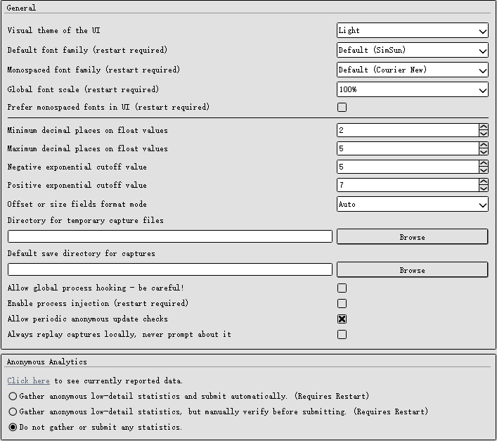
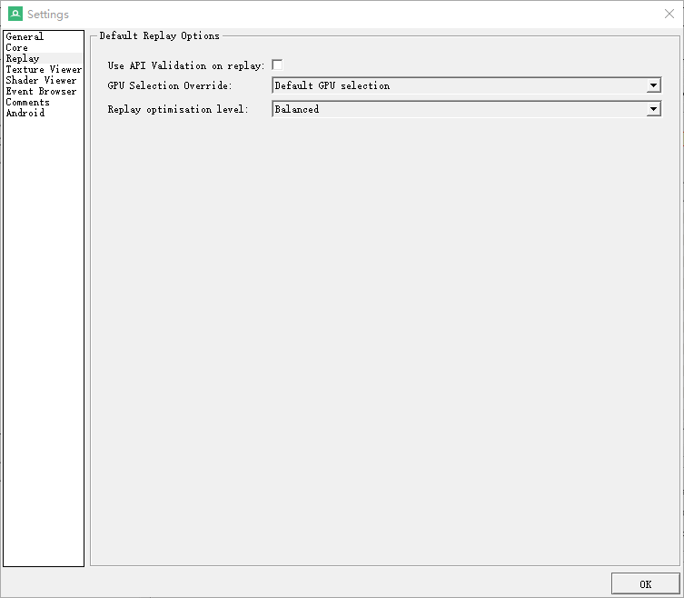
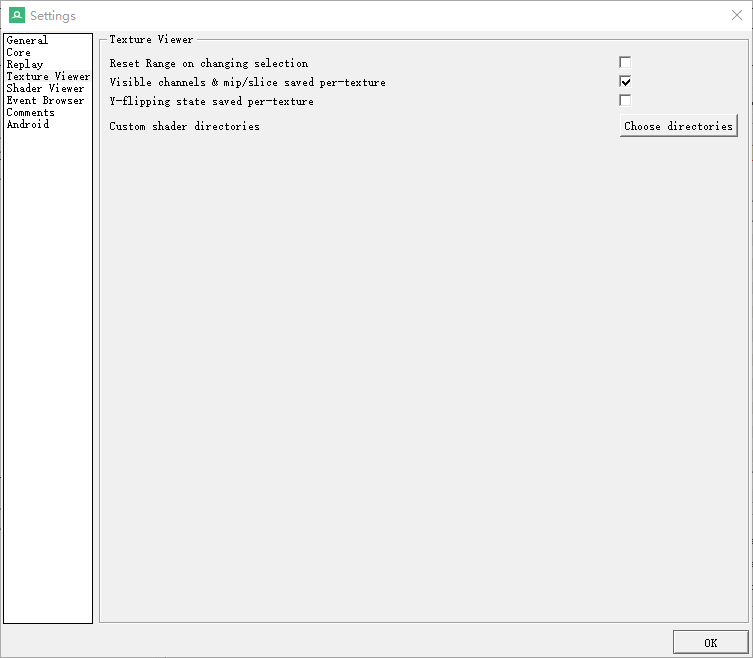
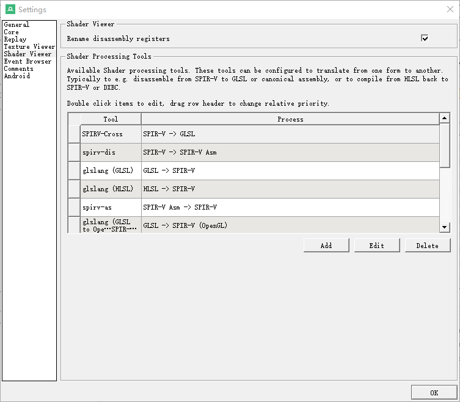
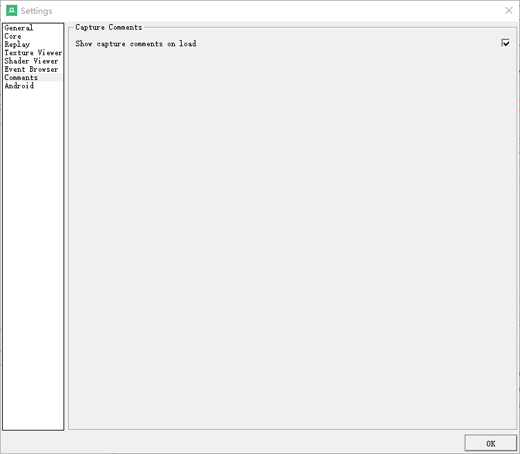
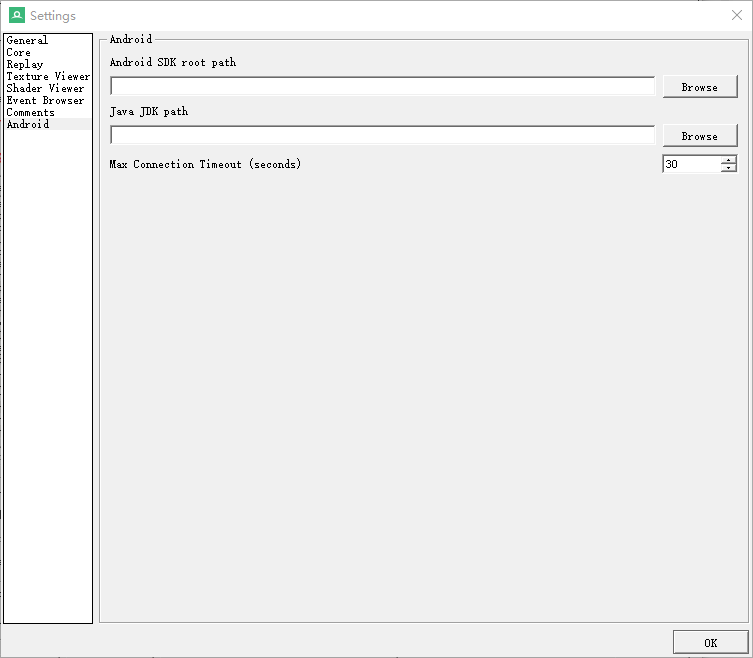

# 设置窗口
打开方式为Tools->Settings
## General

* Visual theme of the UI（界面视觉主题）：选择应用程序的界面主题。
* Default font family (restart required)（默认字体族，需重启）：选择默认的字体族。
* Monospaced font family (restart required)（等宽字体族，需重启）：选择等宽字体族。
* Global font scale (restart required)（全局字体缩放，需重启）：调整全局字体的缩放比例。
* Prefer monospaced fonts in UI (restart required)（界面中优先使用等宽字体，需重启）：在界面中优先使用等宽字体。
* Minimum decimal places on float values（浮点值的最小小数位数）：设置浮点值显示的最小小数位数。
* Maximum decimal places on float values（浮点值的最大小数位数）：设置浮点值显示的最大小数位数。
* Negative exponential cutoff value（负指数截止值）：设置显示负指数形式的截止值。
* Positive exponential cutoff value（正指数截止值）：设置显示正指数形式的截止值。
* Offset or size fields format mode（偏移或大小字段格式模式）：选择偏移或大小字段的显示格式。
* Directory for temporary capture files（临时捕获文件目录）：设置临时捕获文件的存储目录。
* Default save directory for captures（默认捕获文件保存目录）：设置捕获文件的默认保存目录。
* Allow global process hooking – be careful!（允许全局进程挂钩 – 谨慎使用！）：允许全局进程挂钩。
* Enable process injection (restart required)（启用进程注入，需重启）：启用进程注入功能。
* Allow periodic anonymous update checks（允许定期匿名更新检查）：允许定期进行匿名更新检查。
* Always replay captures locally, never prompt about it（始终在本地重放捕获，从不提示）：始终在本地重放捕获文件，不提示用户。

### Anonymous Analytics（匿名分析） 
作用：选择是否收集和提交匿名统计数据。
* Gather anonymous low-detail statistics and submit automatically. (Requires Restart)（收集匿名的低详细统计数据并自动提交，需重启）。
* Gather anonymous low-detail statistics, but manually verify before submitting. (Requires Restart)（收集匿名的低详细统计数据，但在提交前手动验证，需重启）。
* Do not gather or submit any statistics.（不收集或提交任何统计数据）。

## Core

提供了几个配置选项，主要关注于高级配置和与其他工具的集成。这些设置允许用户自定义RenderDoc的核心功能以适应特定的调试需求。以下是这些选项的详细说明：
* Open Advanced Config Editor（打开高级配置编辑器）： 提供一个界面，允许用户编辑RenderDoc的高级配置设置。
* Shader debug search paths（着色器调试搜索路径）：定义查找着色器源代码或其他调试文件时使用的搜索路径。
* Enable Radeon GPU Profiler integration (requires capture reload)（启用Radeon GPU Profiler集成，需要重新加载捕获）：启用与Radeon GPU Profiler的集成，这是一种GPU性能分析工具，专门用于AMD GPU。
* Path to Radeon GPU Profiler executable（Radeon GPU Profiler可执行文件的路径）：指定Radeon GPU Profiler可执行文件的位置，这是必须的如果你启用了Radeon GPU Profiler集成。

## Replay

用户可以配置重放捕获时的一些基本选项。这些设置影响如何重放API调用以及如何验证和优化这些调用的处理。
* Use API Validation on replay (在重放时使用API验证)： 选择在重放捕获时是否启用API验证，以检查API调用的正确性和合规性。
* GPU Selection Override (GPU选择覆盖)：允许用户指定重放捕获时使用的GPU，而不是自动选择。
* Replay optimization level (重放优化级别)：设置在重放捕获时应用的优化级别。

## Texture Viewer

提供了一些与纹理查看器的行为和显示相关的配置选项。
* Reset Range on changing selection（更改选择时重置范围）：选择是否在切换选中的纹理时自动重置显示范围。
* Visible channels & mip/slice saved per-texture（每个纹理保存可见通道和MIP/切片）：保存每个纹理的可见通道和MIP级别或切片设置。
* Y-flipping state saved per-texture（每个纹理保存Y翻转状态）：保存每个纹理的Y翻转状态。
* Custom shader directories（自定义着色器目录）：设置并存储自定义着色器的目录。

## Shader Viewer

你可以配置和管理与着色器处理工具相关的选项，这些工具用于着色器代码的转换和反汇编。这可以帮助用户在不同的着色器语言之间进行转换，或从一个表示形式转换为另一个表示形式，便于分析和调试着色器代码。
* Rename disassembly registers（重命名汇编寄存器）：允许在反汇编视图中重命名寄存器，以便更容易识别和追踪。
* Shader Processing Tools（着色器处理工具）：列出并配置用于着色器代码转换和反汇编的工具。
* Tool and Process Columns（工具和过程列）：展示了不同的工具及其处理过程，例如：
* * SPIRV-Cross：用于将SPIR-V转换为GLSL。
* * spirv-dis：用于将SPIR-V转换为SPIR-V的汇编语言表示。
* * glslang (GLSL)：将GLSL转换为SPIR-V。
* * glslang (HLSL)：将HLSL转换为SPIR-V。
* * spirv-as：将SPIR-V汇编转换为SPIR-V。
* * glslang (GLSL to OpenGL)：将GLSL转换为适用于OpenGL的SPIR-V。

## Event Browser

你可以配置与事件浏览器显示和行为相关的设置。这些设置帮助用户自定义事件浏览器的功能，以便更有效地查看和分析捕获的数据。以下是这些选项的详细说明：
* Time unit used for action durations（用于动作持续时间的时间单位）：选择显示在事件浏览器中的动作持续时间使用的时间单位。
* Add fake markers if none present (requires capture reload)（如果没有标记则添加虚拟标记，需要重新加载捕获）：在没有用户定义标记的情况下自动添加虚拟标记。
* Apply marker colors（应用标记颜色）：在事件浏览器中为标记区域应用颜色。
* * Colorise whole row for marker regions（为标记区域着色整行）：勾选此选项会将整行着色，而不仅仅是标记本身，从而使标记更加显眼易见。

## Comments

你可以配置一个与捕获相关的注释显示选项。这个设置简单但对于提高工作流程的透明度和理解度非常有用。
* Show capture comments on load（加载时显示捕获注释）：决定是否在加载捕获文件时自动显示任何相关的注释。

## Android

* Android SDK root path（Android SDK根路径）：指定Android SDK的根目录路径。
* Java JDK path（Java JDK路径）：指定Java JDK的安装路径。
* Max Connection Timeout (seconds)（最大连接超时时间（秒））：设置RenderDoc与Android设备连接时的最大超时时间。

