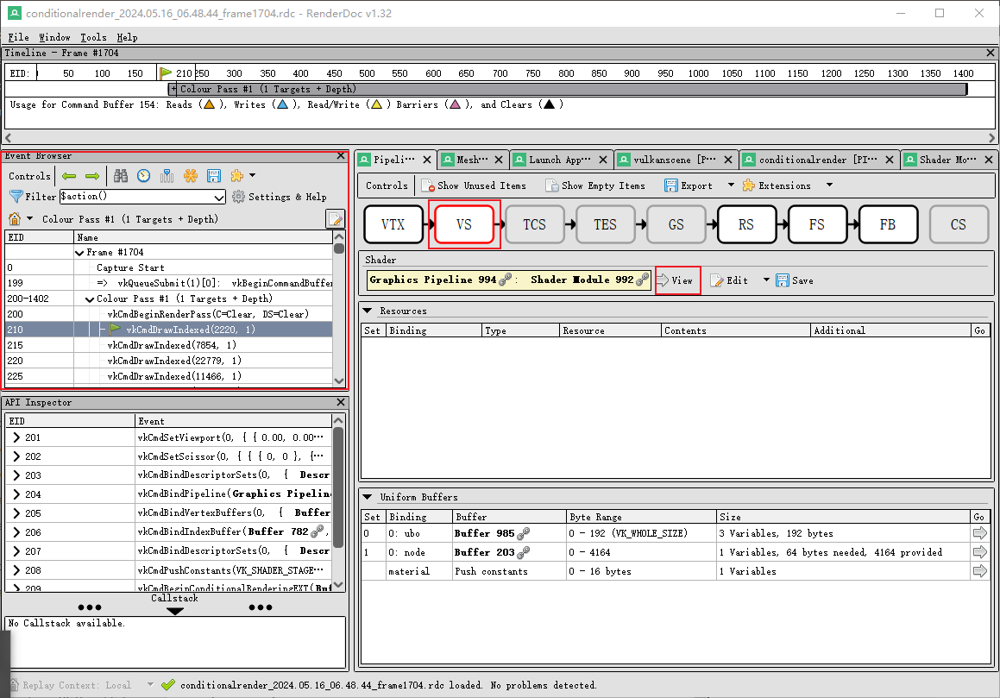
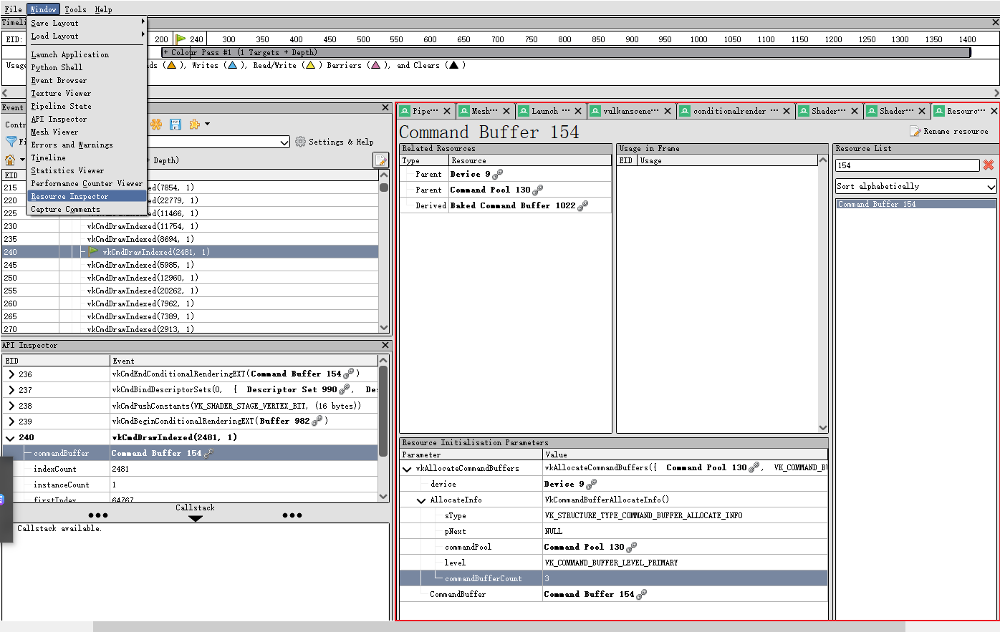

# 如何使用RenderDoc查看shader的调试信息
在介绍这些之前，需要先申明一下目前的RenderDoc仅支持D3D11， D3D12和Vulkan。其他API的调试将会被隐藏或者禁止，并且并不是说有这些API的着色器都能被调试，如果着色器无法调试，下面的选项也将被禁用。

## 在着色器中包含调试信息
我们在接下来的例子中将统一使用Vulkan。 RenderDoc支持通过NonSemantic.Shader.DebugInfo.100扩展指令集进行源码级别的调试。要生成包含调试信息的SPIR-V，你可以使用glslang或dxc编译器。由于我们这里使用的是Vulkan API,我们将使用glslang。
<br/>

### 使用glslang生成调试信息
glslang 是一个用于将GLSL编译为SPIR-V的编译器。使用 -gVS 参数可以指定生成调试信息。如果你还没有安装glslang，可以通过Vulkan SDK下载并安装，其中就包含了glslang工具。现在假设你已经有了glslang编译器，我们手头上刚好有一个顶点着色器 shader.vert，我们通过如下命令将其编译成具有调试信息的SPIR-V。
```bash
glslangValidator -V -g shader.vert -o shader.spv
```
<br/>

为了查看要查看SPIR-V (.spv) 文件的内容，我们需要通过spirv-dis将二进制SPIR-V文件反汇编为人类可读的文本格式。
```bash
spirv-dis shader.spv -o shader.spv.txt
```
<br/>

当然，我们也可以直接在RenderDoc所提供的图形界面进行调试。首先我们需要捕获帧，然后在Event Browser中找到调用顶点着色器的事件，选择你要查看的着色器类型然后点击view查看调试的信息。

<br/>

不论是通过上面的哪一种方法，我们通过调试顶点着色器，我们能得到如下SPIR-V Asm(spirv-dis)格式的调试信息。我们将逐一分析每一段的含义。
```plaintext
; SPIR-V
; Version: 1.0
; Generator: Khronos Glslang Reference Front End; 7
; Bound: 105
; Schema: 0
OpCapability Shader
%1 = OpExtInstImport "GLSL.std.450"
OpMemoryModel Logical GLSL450
OpEntryPoint Vertex %main "main" %outNormal %inNormal %outColor %inPos %_ %outLightVec %outViewVec %inColor
OpSource GLSL 450
OpName %main "main"
OpName %outNormal "outNormal"
OpName %inNormal "inNormal"
OpName %outColor "outColor"
OpName %PushBlock "PushBlock"
OpMemberName %PushBlock 0 "baseColorFactor"
OpName %material "material"
OpName %pos "pos"
OpName %inPos "inPos"
OpName %gl_PerVertex "gl_PerVertex"
OpMemberName %gl_PerVertex 0 "gl_Position"
OpName %_ ""
OpName %UBO "UBO"
OpMemberName %UBO 0 "projection"
OpMemberName %UBO 1 "view"
OpMemberName %UBO 2 "model"
OpName %ubo "ubo"
OpName %Node "Node"
OpMemberName %Node 0 "matrix"
OpName %node "node"
OpName %localpos "localpos"
OpName %lightPos "lightPos"
OpName %outLightVec "outLightVec"
OpName %outViewVec "outViewVec"
OpName %inColor "inColor"
OpDecorate %outNormal Location 0
OpDecorate %inNormal Location 1
OpDecorate %outColor Location 1
OpMemberDecorate %PushBlock 0 Offset 0
OpDecorate %PushBlock Block
OpDecorate %inPos Location 0
OpMemberDecorate %gl_PerVertex 0 BuiltIn Position
OpDecorate %gl_PerVertex Block
OpMemberDecorate %UBO 0 ColMajor
OpMemberDecorate %UBO 0 Offset 0
OpMemberDecorate %UBO 0 MatrixStride 16
OpMemberDecorate %UBO 1 ColMajor
OpMemberDecorate %UBO 1 Offset 64
OpMemberDecorate %UBO 1 MatrixStride 16
OpMemberDecorate %UBO 2 ColMajor
OpMemberDecorate %UBO 2 Offset 128
OpMemberDecorate %UBO 2 MatrixStride 16
OpDecorate %UBO Block
OpDecorate %ubo DescriptorSet 0
OpDecorate %ubo Binding 0
OpMemberDecorate %Node 0 ColMajor
OpMemberDecorate %Node 0 Offset 0
OpMemberDecorate %Node 0 MatrixStride 16
OpDecorate %Node Block
OpDecorate %node DescriptorSet 1
OpDecorate %node Binding 0
OpDecorate %outLightVec Location 3
OpDecorate %outViewVec Location 2
OpDecorate %inColor Location 2
%void = OpTypeVoid
%3 = OpTypeFunction %void
%float = OpTypeFloat 32
%v3float = OpTypeVector %float 3
%_ptr_Output_v3float = OpTypePointer Output %v3float
%outNormal = OpVariable %_ptr_Output_v3float Output
%_ptr_Input_v3float = OpTypePointer Input %v3float
%inNormal = OpVariable %_ptr_Input_v3float Input
%outColor = OpVariable %_ptr_Output_v3float Output
%v4float = OpTypeVector %float 4
%PushBlock = OpTypeStruct %v4float
%_ptr_PushConstant_PushBlock = OpTypePointer PushConstant %PushBlock
%material = OpVariable %_ptr_PushConstant_PushBlock PushConstant
%int = OpTypeInt 32 1
%int_0 = OpConstant %int 0
%_ptr_PushConstant_v4float = OpTypePointer PushConstant %v4float
%_ptr_Function_v4float = OpTypePointer Function %v4float
%inPos = OpVariable %_ptr_Input_v3float Input
%float_1 = OpConstant %float 1
%gl_PerVertex = OpTypeStruct %v4float
%_ptr_Output_gl_PerVertex = OpTypePointer Output %gl_PerVertex
%_ = OpVariable %_ptr_Output_gl_PerVertex Output
%mat4v4float = OpTypeMatrix %v4float 4
%UBO = OpTypeStruct %mat4v4float %mat4v4float %mat4v4float
%_ptr_Uniform_UBO = OpTypePointer Uniform %UBO
%ubo = OpVariable %_ptr_Uniform_UBO Uniform
%_ptr_Uniform_mat4v4float = OpTypePointer Uniform %mat4v4float
%int_1 = OpConstant %int 1
%int_2 = OpConstant %int 2
%Node = OpTypeStruct %mat4v4float
%_ptr_Uniform_Node = OpTypePointer Uniform %Node
%node = OpVariable %_ptr_Uniform_Node Uniform
%_ptr_Output_v4float = OpTypePointer Output %v4float
%mat3v3float = OpTypeMatrix %v3float 3
%_ptr_Function_v3float = OpTypePointer Function %v3float
%float_10 = OpConstant %float 10
%float_n10 = OpConstant %float -10
%94 = OpConstantComposite %v3float %float_10 %float_n10 %float_10
%outLightVec = OpVariable %_ptr_Output_v3float Output
%outViewVec = OpVariable %_ptr_Output_v3float Output
%inColor = OpVariable %_ptr_Input_v3float Input
%main = OpFunction %void None %3
%5 = OpLabel
%pos = OpVariable %_ptr_Function_v4float Function
%localpos = OpVariable %_ptr_Function_v4float Function
%lightPos = OpVariable %_ptr_Function_v3float Function
%12 = OpLoad %v3float %inNormal
OpStore %outNormal %12
%21 = OpAccessChain %_ptr_PushConstant_v4float %material %int_0
%22 = OpLoad %v4float %21
%23 = OpVectorShuffle %v3float %22 %22 0 1 2
OpStore %outColor %23
%27 = OpLoad %v3float %inPos
%29 = OpCompositeExtract %float %27 0
%30 = OpCompositeExtract %float %27 1
%31 = OpCompositeExtract %float %27 2
%32 = OpCompositeConstruct %v4float %29 %30 %31 %float_1
OpStore %pos %32
%41 = OpAccessChain %_ptr_Uniform_mat4v4float %ubo %int_0
%42 = OpLoad %mat4v4float %41
%44 = OpAccessChain %_ptr_Uniform_mat4v4float %ubo %int_1
%45 = OpLoad %mat4v4float %44
%46 = OpMatrixTimesMatrix %mat4v4float %42 %45
%48 = OpAccessChain %_ptr_Uniform_mat4v4float %ubo %int_2
%49 = OpLoad %mat4v4float %48
%50 = OpMatrixTimesMatrix %mat4v4float %46 %49
%54 = OpAccessChain %_ptr_Uniform_mat4v4float %node %int_0
%55 = OpLoad %mat4v4float %54
%56 = OpMatrixTimesMatrix %mat4v4float %50 %55
%57 = OpLoad %v4float %pos
%58 = OpMatrixTimesVector %v4float %56 %57
%60 = OpAccessChain %_ptr_Output_v4float %_ %int_0
OpStore %60 %58
%61 = OpAccessChain %_ptr_Uniform_mat4v4float %ubo %int_1
%62 = OpLoad %mat4v4float %61
%63 = OpAccessChain %_ptr_Uniform_mat4v4float %ubo %int_2
%64 = OpLoad %mat4v4float %63
%65 = OpMatrixTimesMatrix %mat4v4float %62 %64
%66 = OpAccessChain %_ptr_Uniform_mat4v4float %node %int_0
%67 = OpLoad %mat4v4float %66
%68 = OpMatrixTimesMatrix %mat4v4float %65 %67
%70 = OpCompositeExtract %v4float %68 0
%71 = OpVectorShuffle %v3float %70 %70 0 1 2
%72 = OpCompositeExtract %v4float %68 1
%73 = OpVectorShuffle %v3float %72 %72 0 1 2
%74 = OpCompositeExtract %v4float %68 2
%75 = OpVectorShuffle %v3float %74 %74 0 1 2
%76 = OpCompositeConstruct %mat3v3float %71 %73 %75
%77 = OpLoad %v3float %inNormal
%78 = OpMatrixTimesVector %v3float %76 %77
OpStore %outNormal %78
%80 = OpAccessChain %_ptr_Uniform_mat4v4float %ubo %int_1
%81 = OpLoad %mat4v4float %80
%82 = OpAccessChain %_ptr_Uniform_mat4v4float %ubo %int_2
%83 = OpLoad %mat4v4float %82
%84 = OpMatrixTimesMatrix %mat4v4float %81 %83
%85 = OpAccessChain %_ptr_Uniform_mat4v4float %node %int_0
%86 = OpLoad %mat4v4float %85
%87 = OpMatrixTimesMatrix %mat4v4float %84 %86
%88 = OpLoad %v4float %pos
%89 = OpMatrixTimesVector %v4float %87 %88
OpStore %localpos %89
OpStore %lightPos %94
%96 = OpLoad %v3float %lightPos
%97 = OpLoad %v4float %localpos
%98 = OpVectorShuffle %v3float %97 %97 0 1 2
%99 = OpFSub %v3float %96 %98
OpStore %outLightVec %99
%101 = OpLoad %v4float %localpos
%102 = OpVectorShuffle %v3float %101 %101 0 1 2
%103 = OpFNegate %v3float %102
OpStore %outViewVec %103
OpReturn
OpFunctionEnd
```
<br/>

```plaintext
; SPIR-V
; Version: 1.0
; Generator: Khronos Glslang Reference Front End; 7
; Bound: 105
; Schema: 0
```
上面的属于基本信息。<br/>
* __SPIR-V__：文件格式的类型。
* __Version__: 1.0：SPIR-V版本。
* __Generator__: Khronos Glslang Reference Front End; 7：生成此SPIR-V代码的工具（Glslang）。
* __Bound__: 105：该模块使用的最大ID值。
* __Schema: 0__：SPIR-V schema版本。
<br/>

```plaintext
OpCapability Shader
%1 = OpExtInstImport "GLSL.std.450"
OpMemoryModel Logical GLSL450
OpEntryPoint Vertex %main "main" %outNormal %inNormal %outColor %inPos %_ %outLightVec %outViewVec %inColor
OpSource GLSL 450
```
这部分属于能力和扩展指令集。<br/>
* OpCapability Shader：声明此模块使用的SPIR-V能力，这里声明它是一个着色器模块。
* %1 = OpExtInstImport "GLSL.std.450"：导入GLSL标准库扩展指令集。
* OpMemoryModel Logical GLSL450：指定内存模型（Logical）和地址空间（GLSL450）。
* OpEntryPoint Vertex %main "main" ...：定义入口点（着色器类型是顶点着色器），并列出入口点的接口变量。
* OpSource GLSL 450：指定源语言和版本（GLSL 450）。
<br/>

```plaintext
OpName %main "main"
OpName %outNormal "outNormal"
OpName %inNormal "inNormal"
OpName %outColor "outColor"
OpName %PushBlock "PushBlock"
OpMemberName %PushBlock 0 "baseColorFactor"
OpName %material "material"
OpName %pos "pos"
OpName %inPos "inPos"
OpName %gl_PerVertex "gl_PerVertex"
OpMemberName %gl_PerVertex 0 "gl_Position"
OpName %_ ""
OpName %UBO "UBO"
OpMemberName %UBO 0 "projection"
OpMemberName %UBO 1 "view"
OpMemberName %UBO 2 "model"
OpName %ubo "ubo"
OpName %Node "Node"
OpMemberName %Node 0 "matrix"
OpName %node "node"
OpName %localpos "localpos"
OpName %lightPos "lightPos"
OpName %outLightVec "outLightVec"
OpName %outViewVec "outViewVec"
OpName %inColor "inColor"
```
百分号之后的这些都属于顶点着色器中的变量。
<br/>

```plaintext
%main = OpFunction %void None %3
%5 = OpLabel
%pos = OpVariable %_ptr_Function_v4float Function
%localpos = OpVariable %_ptr_Function_v4float Function
%lightPos = OpVariable %_ptr_Function_v3float Function
%12 = OpLoad %v3float %inNormal
OpStore %outNormal %12
%21 = OpAccessChain %_ptr_PushConstant_v4float %material %int_0
%22 = OpLoad %v4float %21
%23 = OpVectorShuffle %v3float %22 %22 0 1 2
OpStore %outColor %23
%27 = OpLoad %v3float %inPos
%29 = OpCompositeExtract %float %27 0
%30 = OpCompositeExtract %float %27 1
%31 = OpCompositeExtract %float %27 2
%32 = OpCompositeConstruct %v4float %29 %30 %31 %float_1
OpStore %pos %32
%41 = OpAccessChain %_ptr_Uniform_mat4v4float %ubo %int_0
%42 = OpLoad %mat4v4float %41
%44 = OpAccessChain %_ptr_Uniform_mat4v4float %ubo %int_1
%45 = OpLoad %mat4v4float %44
%46 = OpMatrixTimesMatrix %mat4v4float %42 %45
%48 = OpAccessChain %_ptr_Uniform_mat4v4float %ubo %int_2
%49 = OpLoad %mat4v4float %48
%50 = OpMatrixTimesMatrix %mat4v4float %46 %49
%54 = OpAccessChain %_ptr_Uniform_mat4v4float %node %int_0
%55 = OpLoad %mat4v4float %54
%56 = OpMatrixTimesMatrix %mat4v4float %50 %55
%57 = OpLoad %v4float %pos
%58 = OpMatrixTimesVector %v4float %56 %57
%60 = OpAccessChain %_ptr_Output_v4float %_ %int_0
OpStore %60 %58
%61 = OpAccessChain %_ptr_Uniform_mat4v4float %ubo %int_1
%62 = OpLoad %mat4v4float %61
%63 = OpAccessChain %_ptr_Uniform_mat4v4float %ubo %int_2
%64 = OpLoad %mat4v4float %63
%65 = OpMatrixTimesMatrix %mat4v4float %62 %64
%66 = OpAccessChain %_ptr_Uniform_mat4v4float %node %int_0
%67 = OpLoad %mat4v4float %66
%68 = OpMatrixTimesMatrix %mat4v4float %65 %67
%70 = OpCompositeExtract %v4float %68 0
%71 = OpVectorShuffle %v3float %70 %70 0 1 2
%72 = OpCompositeExtract %v4float %68 1
%73 = OpVectorShuffle %v3float %72 %72 0 1 2
%74 = OpCompositeExtract %v4float %68 2
%75 = OpVectorShuffle %v3float %74 %74 0 1 2
%76 = OpCompositeConstruct %mat3v3float %71 %73 %75
%77 = OpLoad %v3float %inNormal
%78 = OpMatrixTimesVector %v3float %76 %77
OpStore %outNormal %78
%80 = OpAccessChain %_ptr_Uniform_mat4v4float %ubo %int_1
%81 = OpLoad %mat4v4float %80
%82 = OpAccessChain %_ptr_Uniform_mat4v4float %ubo %int_2
%83 = OpLoad %mat4v4float %82
%84 = OpMatrixTimesMatrix %mat4v4float %81 %83
%85 = OpAccessChain %_ptr_Uniform_mat4v4float %node %int_0
%86 = OpLoad %mat4v4float %85
%87 = OpMatrixTimesMatrix %mat4v4float %84 %86
%88 = OpLoad %v4float %pos
%89 = OpMatrixTimesVector %v4float %87 %88
OpStore %localpos %89
OpStore %lightPos %94
%96 = OpLoad %v3float %lightPos
%97 = OpLoad %v4float %localpos
%98 = OpVectorShuffle %v3float %97 %97 0 1 2
%99 = OpFSub %v3float %96 %98
OpStore %outLightVec %99
%101 = OpLoad %v4float %localpos
%102 = OpVectorShuffle %v3float %101 %101 0 1 2
%103 = OpFNegate %v3float %102
OpStore %outViewVec %103
OpReturn
OpFunctionEnd
```
这一段属于是顶点着色器中的主函数，但在之前加了许多新的变量名，以下是对新变量名的解释:
* %main = OpFunction %void None %3：定义主函数main。
* OpLabel：定义基本块标签。
* 变量声明：在函数中声明局部变量。
* OpLoad 和 OpStore：加载和存储变量。
* OpAccessChain：访问结构体成员或数组元素。
* OpMatrixTimesMatrix 和 OpMatrixTimesVector：矩阵与矩阵、矩阵与向量的乘法。
* OpCompositeExtract 和 OpCompositeConstruct：从向量中提取分量和构造向量。
* OpReturn 和 OpFunctionEnd：返回并结束函数。
<br/>

看完上面的调试信息是不是觉得晦涩难懂，这时候RenderDoc的作用便体现了出来，它将器翻译为更加符合人类能够理解的语言。
.png)
通过勾选上面的选项，我们便能把SPIR-V转换为我们能看得懂的标签化语言, 这极大地简化了我们在定位问题时候的复杂程度。
```plaintext
SPIR-V 1.0 module, <id> bound of 105

Generator: Glslang Reference Front End from Khronos - Contact John Kessenich, johnkessenich@google.com
Generator Version: 7

Capability(Shader);


MemoryModel(Logical, GLSL450);

EntryPoint(Vertex, main, "main", {outNormal, inNormal, outColor, inPos, gl_PerVertex_var, outLightVec, outViewVec, inColor});


Source(GLSL, 450);


Output float3* outNormal : [[Location(0)]];
Input float3* inNormal : [[Location(1)]];
Output float3* outColor : [[Location(1)]];
struct PushBlock : [[Block]] {
  float4 baseColorFactor : [[Offset(0)]];
}
PushConstant PushBlock* material;
Input float3* inPos : [[Location(0)]];
struct gl_PerVertex : [[Block]] {
  float4 gl_Position : [[BuiltIn(Position)]];
}
Output gl_PerVertex* gl_PerVertex_var;
struct UBO : [[Block]] {
  float4x4 projection : [[ColMajor, MatrixStride(16), Offset(0)]];
  float4x4 view : [[ColMajor, MatrixStride(16), Offset(64)]];
  float4x4 model : [[ColMajor, MatrixStride(16), Offset(128)]];
}
Uniform UBO* ubo : [[DescriptorSet(0), Binding(0)]];
struct Node : [[Block]] {
  float4x4 matrix : [[ColMajor, MatrixStride(16), Offset(0)]];
}
Uniform Node* node : [[DescriptorSet(1), Binding(0)]];
Output float3* outLightVec : [[Location(3)]];
Output float3* outViewVec : [[Location(2)]];
Input float3* inColor : [[Location(2)]];

void main() {
  float4* pos;
  float4* localpos;
  float3* lightPos;
  float3 _12 = *inNormal;
  *outNormal = _12;
  float4* _21 = &material.baseColorFactor;
  float4 _22 = *_21;
  float3 _23 = _22.xyz;
  *outColor = _23;
  float3 _27 = *inPos;
  float _29 = _27.x;
  float _30 = _27.y;
  float _31 = _27.z;
  float4 _32 = CompositeConstruct({_29, _30, _31, 1.0000});
  *pos = _32;
  float4x4* _41 = &ubo.projection;
  float4x4 _42 = *_41;
  float4x4* _44 = &ubo.view;
  float4x4 _45 = *_44;
  float4x4 _46 = _42 * _45;
  float4x4* _48 = &ubo.model;
  float4x4 _49 = *_48;
  float4x4 _50 = _46 * _49;
  float4x4* _54 = &node.matrix;
  float4x4 _55 = *_54;
  float4x4 _56 = _50 * _55;
  float4 _57 = *pos;
  float4 _58 = _56 * _57;
  float4* _60 = &gl_PerVertex_var.gl_Position;
  *_60 = _58;
  float4x4* _61 = &ubo.view;
  float4x4 _62 = *_61;
  float4x4* _63 = &ubo.model;
  float4x4 _64 = *_63;
  float4x4 _65 = _62 * _64;
  float4x4* _66 = &node.matrix;
  float4x4 _67 = *_66;
  float4x4 _68 = _65 * _67;
  float4 _70 = _68[0];
  float3 _71 = _70.xyz;
  float4 _72 = _68[1];
  float3 _73 = _72.xyz;
  float4 _74 = _68[2];
  float3 _75 = _74.xyz;
  float3x3 _76 = CompositeConstruct({_71, _73, _75});
  float3 _77 = *inNormal;
  float3 _78 = _76 * _77;
  *outNormal = _78;
  float4x4* _80 = &ubo.view;
  float4x4 _81 = *_80;
  float4x4* _82 = &ubo.model;
  float4x4 _83 = *_82;
  float4x4 _84 = _81 * _83;
  float4x4* _85 = &node.matrix;
  float4x4 _86 = *_85;
  float4x4 _87 = _84 * _86;
  float4 _88 = *pos;
  float4 _89 = _87 * _88;
  *localpos = _89;
  *lightPos = {10.0000, -10.0000, 10.0000};
  float3 _96 = *lightPos;
  float4 _97 = *localpos;
  float3 _98 = _97.xyz;
  float3 _99 = _96 - _98;
  *outLightVec = _99;
  float4 _101 = *localpos;
  float3 _102 = _101.xyz;
  float3 _103 = -_102;
  *outViewVec = _103;
  return;
}
```
<br/>

除此之外，我们还可以通过调用Resource Inspector的方式查看缓存和函数使用的具体情况。

<br/>


