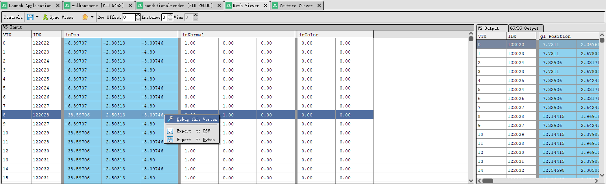
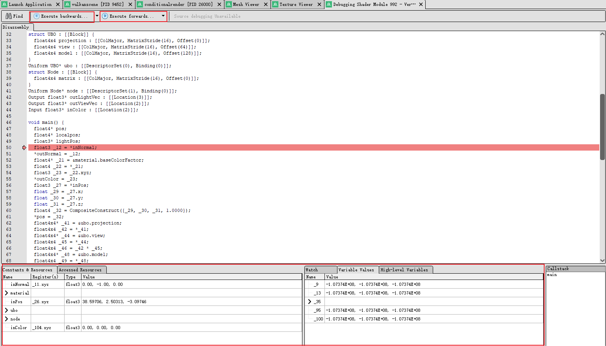
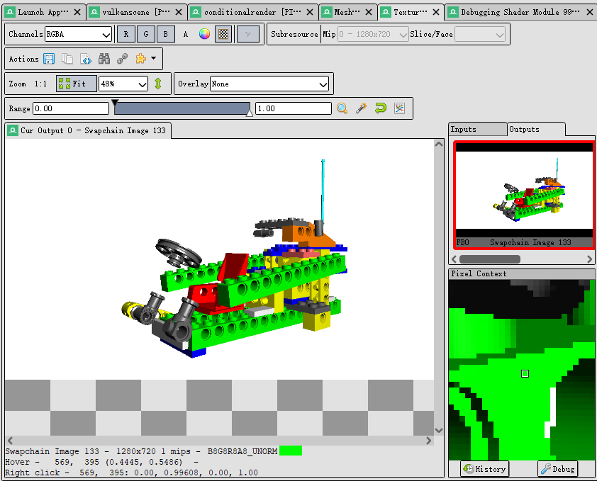
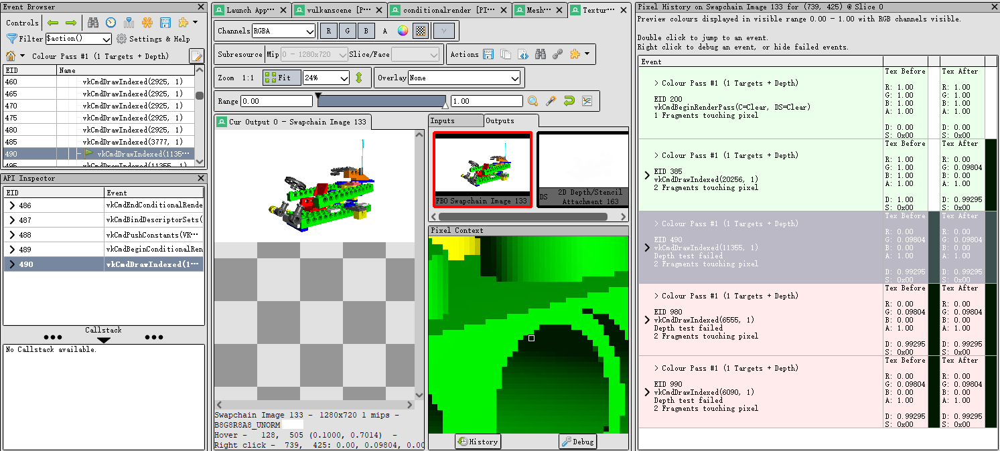
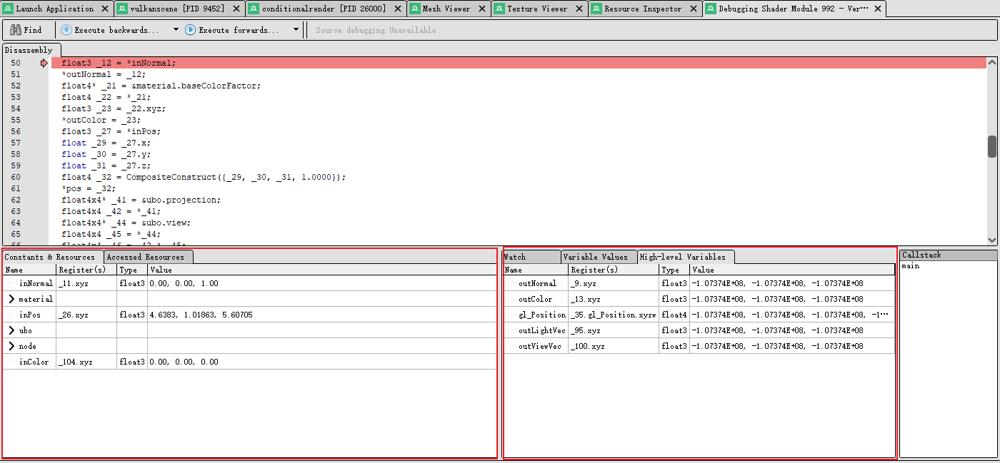
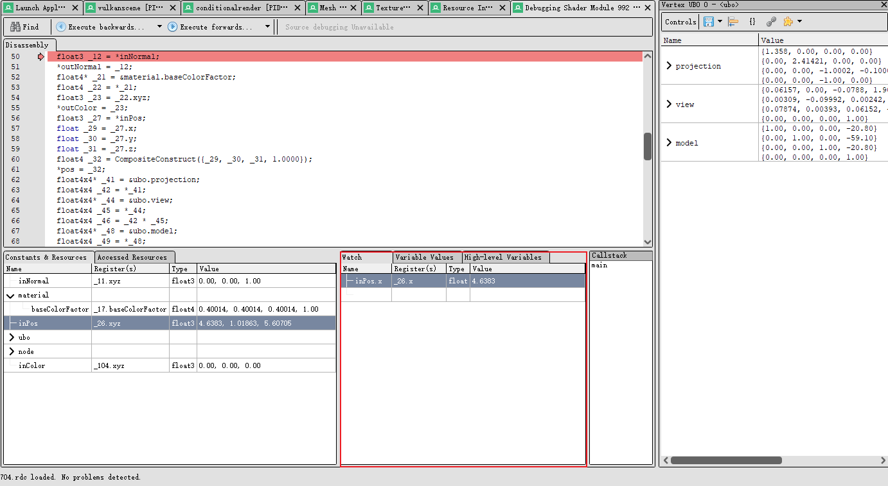

# 调试着色器
## 调试顶点
为了调试顶点的信息，我们首先需要从渲染程序运行中抓取帧。我们选中抓取到的帧，打开Event Browser窗口，从中选取我们希望调式的事件。调出Mesh Viewer窗口，选中我们需要调试的顶点，右击调出Debug选项。

 

在我们点击了Debug this vertex之后便会出现如下图的调式画面：

 

我们通过点击红框中的Excute backwards和Execute forwards来控制调试的前进和后退。需要注意的是，到目前为止，几何着色器和细分着色器尚不支持调试。
 

## 调试像素
获取像素的方法我们在quick start的章节中已经提及，我们这里再温习一下。我们打开texture view窗口，在窗口中长按右键来实时获取纹理中的像素颜色。

 

当我们选中一个像素的时候，RenderDoc为我们提供了更为方便的功能。当我们点击History的时候，我们能查出当前像素点在不同事件节点所呈现的颜色。如果我们点击Debug按钮，那我们便可以进行调试顶点的工作。

 

## 调试控制

在我们进行调试的时候，我们能对调试步骤进行配置。

 

由于execute backwards和run forwards是相互对称的，我们介绍的时候将不会区分backwards和forwards。
* __Run__: 从当前位置一直运行到程序的结束或开始。
* __Run to Sample__: 将运行到下一个纹理加载、收集或采样操作，然后停止，就像在该指令上放置了断点一样。
* __Execute forwards/backwards__: 前进将执行当前指令并继续执行下一条指令 - 这包括遵循任何流程控制语句，例如跳转、循环等。/后退将跳回到导致当前指令的任何指令。
* __Run to Cursor__:将运行到光标处。 这将以与“运行”命令类似的方式执行，但是当它到达光标突出显示的行时，它将停止并暂停执行。

## 调试显示

 
在调试的时候，我们还需要注意两个窗口。首先是左边小角的窗口，其中寄存器所存储的值是一个常数，不会随着程序的运行而改变。右下角的则与之相反，他们的值随着程序的运行而不断变换。

 
上图是这节最后将介绍的窗口，不同于上图的两个窗口，这个窗口中的内容完全由我们自定义生成。

