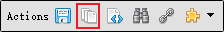
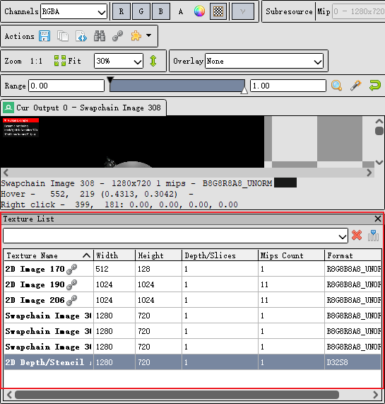
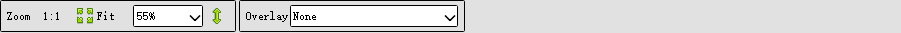
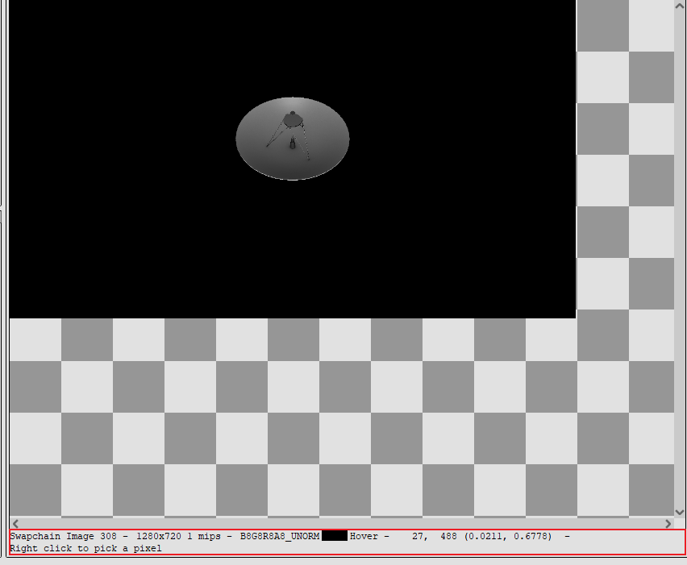

# 如何查看特定的纹理
我们首先从渲染窗口截取一帧，创建Texture Viewer窗口。点击Actions中的texture list按钮。
在点击了按钮之后，我们便能获得如下的纹理列表。在这份纹理列表里列举了这一帧使用到的所有纹理。

 

在Zoom工具栏中，有两大块功能。通过按Fit，软件会自动设置纹理的大小，调整到最适合窗口的大小。通过Overlay的下拉菜单我们可以观察当前绘制中影响到的像素区域、深度测试（绿Pass红Fail）、模板测试、背面剔除等结果。

 

在Texture View的下方显示了当前纹理的一些细节如纹理编号，像素大小，minimip编号等。

 

当我们点击Event Browser中的一个事件的时候，在Texture Viewer中显示的是当前事件中调用的纹理输出。如果我们现在任何事件的时候都能查看同一个纹理的话，我们可以通过打开new Locked Tab的方法。打开的具体方法为右击thumbnail中想打开的texture,选择Open new Locked Tab。我们所打开的texture tab就会固定在Texture View上面的标签栏中，随时供我们查看。