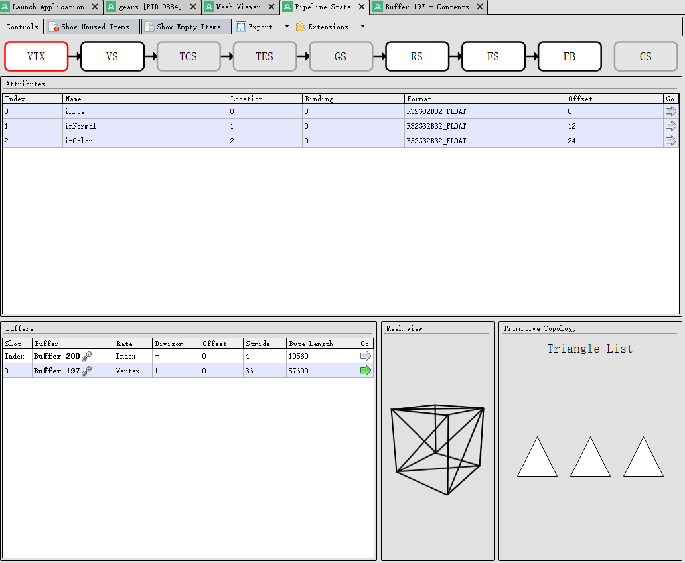

# 如何查看一个物体的细节
## 查看着色器
着色器在渲染管线中扮演了关键角色，控制了很多视觉效果的生成，如控制物体的外观， 调试光照和阴影， 纹理映射和细节， 调试材质和表面属性， 理解和优化视觉效果。通过查看和调试着色器代码，我们能够深入了解更多物体的细节。RenderDoc提供了pipeline state viewer这个选项为我们查看着色器的细节提供了方便的途径。在RenderDoc中，加粗加有锁链的字体代表能够被点击以获取更多的信息。

 

每个传递给编译器的着色器文件都会显示简单的语法高亮，同时还会显示从字节码生成的反汇编代码。如果可用，着色器调试信息中的反射数据将用于管线状态查看器的其他区域。这些数据将用于命名纹理槽位，显示绑定到着色器中的资源，以及显示着色器中使用的任何常量的名称。

## 查看纹理
纹理对于了解和调试一个物体的细节至关重要，其定义了表面细节， 光照和阴影效果， 反射和折射， 材质属性等多个方面。通过查看和调试纹理，开发者可以发现和修复纹理相关的问题，优化物体的外观和渲染性能，从而提升图形应用程序的整体质量和表现。Texture Viewer是查看纹理细节的主要途径之一，当纹理作为资源或输出绑定到管线时，相关部分会显示其尺寸和格式。在每个位置，前往箭头（go arrow）会指示可以在纹理查看器中打开一个新的锁定标签页。

 

除了打开纹理的新视图外，时间轴栏（Timeline Bar）还会显示该纹理的使用情况

 

## 查看缓冲
缓冲区不仅存储了顶点和索引数据，还包含了着色器使用的常量数据和计算结果。通过查看和调试缓冲区数据，开发者可以：

* 确保顶点和索引数据的正确性
* 验证和调试着色器参数
* 优化显存使用和提升性能
* 发现和修复数据错误 
这些操作可以显著增强物体的细节和真实性，提升图形应用程序的整体质量和表现 

我们在这里有两种查看缓冲的方法，第一种是通过pipeline state。我们首先调出pipeline窗口，我们会得到如下图的界面，此时假设我们想查看inPos, inNormal和inColor的缓冲值，我们将光标移向窗口下方的Buffers区域，当我们移动到对应的Buffer时候，顶点和缓冲会提示相同的颜色。

 

这时我们在点击右侧的箭头就会获得下图的数据，这是我们便能清楚地看到buffer在着色器中地格式。

 

