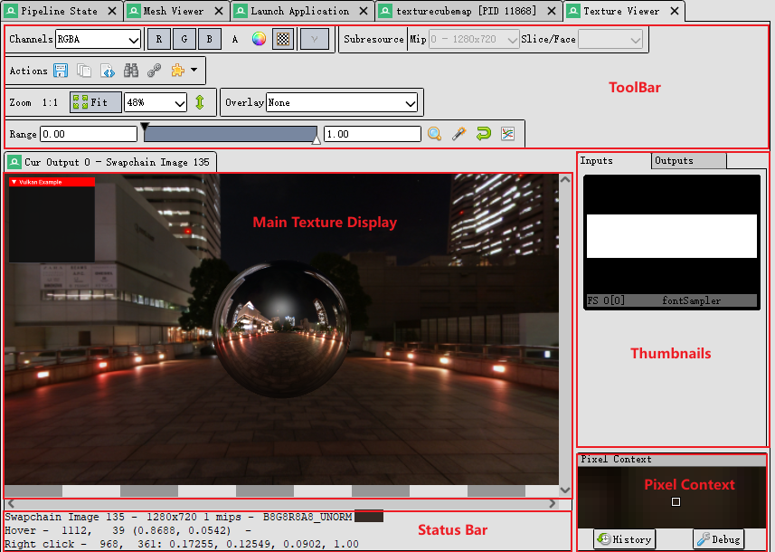
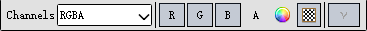
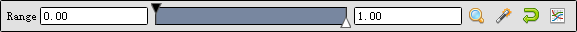

# 纹理窗口
在RenderDoc中，Texture Viewer 是一个强大的工具，用于查看和分析捕获帧中的纹理资源。它提供了多种功能来帮助开发者深入了解纹理的内容和使用情况，调试图形渲染问题。

## 窗口结构

正如上图说所示，纹理窗口可以大致分为Toolbar, Main Texture Display, Thumbnails, Pixel Context和Status Bar这几部分，我们对每一个部分逐一进行说明。

## Main Texture Display
在RenderDoc的Texture Viewer中，Main Texture Display（主纹理显示）是核心功能，用于详细查看和分析纹理的内容。以下是该功能的详细介绍及操作方法：
* 显示纹理内容 
__操作方法：__ 
1. 在RenderDoc中加载一个捕获的帧。
2. 打开Texture Viewer。
3. 在左侧的事件浏览器中，选择一个包含纹理的绘制调用。
4. 点击RenderDoc菜单栏中的Window，选择“Texture Viewer”。
5. 在Main Texture Display窗口中查看所选纹理的内容。
 

* 缩放和平移 
__缩放操作方法：__ 
使用鼠标滚轮在Main Texture Display窗口中放大或缩小纹理。 
__平移操作方法：__ 
点击并按住鼠标左键，然后拖动以平移纹理查看不同部分。
 

* 像素拾取 
__操作方法：__ 
1. 在Main Texture Display窗口中，移动鼠标指针到你感兴趣的像素位置。
2. 右键点击该像素。
3. 在弹出的信息框中查看该像素的详细信息，包括颜色值和深度值。
 

* 切换纹理通道 
__操作方法：__ 
1. 在Texture Viewer的Tool Bar中找到通道选择器。
2. 勾选或取消勾选红色（R）、绿色（G）、蓝色（B）和透明（A）通道，以选择要查看的纹理通道。
3. Main Texture Display窗口将根据选择显示相应的通道内容。
 

## Information Status Bar
在RenderDoc的Texture Viewer中，Information Status Bar（信息状态栏）提供了关于当前显示的纹理和光标位置的详细信息。以下是Information Status Bar的功能介绍和操作方法：
* 纹理格式和尺寸 
显示当前纹理的格式和尺寸，包括宽度、高度、深度和mipmap级别等信息。帮助开发者快速了解纹理的基本属性，确保纹理符合预期。
 

* 光标位置和像素值 
显示光标当前悬停的像素坐标及其颜色值和深度值。帮助开发者详细分析特定像素的渲染结果，调试颜色和深度问题。
 

* 选中像素的详细信息 
当选中一个像素时，显示该像素的详细信息，包括RGBA值和其他相关数据。提供更深入的像素数据，帮助开发者精确调试和分析。
 

## Thumbnails
在RenderDoc的Texture Viewer中，Thumbnails（缩略图）是一种方便的工具，用于快速预览和访问纹理、渲染目标和其他资源。下面是这个功能的详细介绍及操作方法：
* 快速预览 
显示纹理和渲染目标的缩略图，提供资源的简化预览。
 

* 资源类型分类 
显示光标当前悬停的像素坐标及其颜色值和深度值。帮助开发者详细分析特定像素的渲染结果，调试颜色和深度问题。
 

* 点击打开详细视图 
右击缩略图，点击Open new Locked Tab将缩略图的信息固定到Main Texture Display上以查看更为详细的纹理信息。
 

## Pixel Context
在RenderDoc的Texture Viewer中，Pixel Context 是一个用于详细分析特定像素的工具。它提供了特定像素周围区域的放大视图，并显示该像素的详细信息。
* 上下文放大视图 
__操作方法：__ 
1. 将鼠标光标移动到纹理的不同位置。
2. Pixel Context 会显示选定像素及其周围区域的放大视图。
 

* 分析像素历史 
__操作方法：__ 
1. 在Pixel Context中，点击History按键查看选定像素在渲染管线中的读写历史。
 

## Toolbar
Toolbar是一个工具集的总称，其中包含一系列的子工具集，其中有Channels, Subsource, Actions, Zoom, Overlay, 和Range。
### Channels

Channel（通道）功能用于选择和查看纹理的不同颜色通道。通过分别点击图形界面中的R,G,B,A，开发者可以独立或组合查看红色、绿色、蓝色和透明度（Alpha）通道的内容。通过channels的下拉菜单，我们还可以对不同的通道加以选择。其中RGBA通道格式是最常见的颜色模型之一，包含红色（R）、绿色（G）、蓝色（B）和透明度（Alpha，A）通道。RGBM是一种用于高动态范围（HDR）图像的编码格式，其中M是一个乘数，用于扩展颜色的动态范围。YUVA通道格式用于视频编码和图像处理，其中Y表示亮度（Luma），U和V表示色度（Chroma），A表示透明度。最后的是Custom通道， 该通道允许开发者自定义通道组合和显示方式，适应特定的图像处理需求。
 

除此之外，在R,G,B,A的右侧还有两个选项分别是Choose background color和Checkerboard background。Choose Background Color 允许开发者选择和设置纹理显示的背景颜色。通过设置不同的背景颜色，可以更清晰地查看纹理的透明部分和边缘细节。而Checkerboard Background 使用棋盘格图案作为纹理显示的背景，因为透明部分在棋盘格背景上会显得非常明显。
 

### Subresource selection
在RenderDoc的Texture Viewer中，Subresource 是用于查看和选择特定纹理子资源的工具。纹理子资源可以包括不同的mipmap级别、数组层或立方体贴图的面, 选择3D纹理和2D数组的切片, 多重采样纹理的选择。
 

### Actions
在Actions中包含save texture, open texture list, open texture data in buffer viewer, goto pixel location 和 open resource inspector。
* save texture: 保存当前可见的纹理
* open texture list: 保存当前可见的纹理
* Open Texture data in Buffer Viewer: 在原始缓冲区查看器中打开纹理。
* Goto pixel location: 在主纹理视图上方打开一个小弹出窗口，让您输入要跳转到的像素位置。
* Open Resource Inspector: 在资源检查器中打开当前可见的纹理，使您可以查看有关如何创建对象以及可能与其相关的任何其他资源的更多详细信息。
 

### Zoom
这个模块包含4个选项，其中1:1表示将图片变化到与原图相同的尺寸。点击Fit的话RenderDoc将自动采用最合适的尺寸。对于下拉菜单，我们可以选择手动输入也可以选择选择给定的现成数字，纹理的大小将按照你选择的大小进行展示。最后一个双向箭头的按钮代表翻转Y，将 y=0 更改为位于窗口底部而不是顶部。

### Overlay
通过在纹理上叠加额外的信息或视觉效果，帮助开发者详细分析和调试纹理的各个方面。
* Highlight Drawcall: 用于突出高亮显示特定的绘制调用及其影响区域。
* Wireframe Mesh: 在图像顶部渲染当前绘制调用的线框网格。
* Depth Test: 功能用于检查和调试深度缓冲区（Depth Buffer）中像素的深度值。深度测试决定了像素在3D场景中的前后关系。
* Stencil Test：用于查看和调试模板缓冲区（Stencil Buffer）的内容。
* Backface Cull： 用于控制和调试渲染过程中哪些三角形面会被剔除。
* Viewport/Scissor: 用于控制渲染过程中绘制的区域。通过设置视口和剪刀矩形，开发者可以精确控制哪些部分的渲染结果会被显示或裁剪。
* NaN/Inf/-ve display: 将以灰度渲染图像。
* Clipping： Clipping功能会将低于当前黑色点（由Range Control定义）的值以红色高亮显示，将高于白色点的值以绿色高亮显示。
* Clear before Pass：功能用于在执行渲染通道前清除特定的渲染目标。这可以确保渲染通道在干净的状态下开始，避免受到之前渲染结果的影响。
* Clear before Draw： 工作原理与上面类似，但在所选绘制之前立即清除。
* Quad Overdraw (Pass)： 用于可视化和调试四边形（quad）过度绘制的情况。过度绘制是指在同一像素位置重复绘制多次，这可能导致性能问题。通过使用Quad Overdraw，开发者可以查看每个像素位置的绘制次数，并识别和优化可能的性能瓶颈。
* Quad Overdraw (Draw)： 将显示与上述选项类似的可视化效果，但仅限于当前绘制调用。
* Triangle Size (Pass)： 用于可视化和调试每个三角形的大小。通过查看和分析三角形大小，开发者可以识别渲染过程中可能存在的几何复杂度问题，并优化渲染性能。
* Triangle Size (Draw)： 将显示与上述选项类似的可视化效果，但仅限于当前绘制调用。

### Range Control
在RenderDoc的Texture Viewer中，Range Control 是一个用于调整和控制显示范围的工具。它允许开发者细致调整纹理的可视范围，特别是对于HDR（高动态范围）图像，因为它可用于将更大的范围映射到 LDR 进行显示，帮助更好地查看和分析纹理细节。“Range”指的是纹理显示的亮度范围，即图像中从最暗到最亮部分的显示范围。

* 调整显示范围 
__操作方法：__ 
1. 在Range Control中，有两个滑块分别控制黑色点和白色点。
2. 拖动滑块：点击并拖动黑色点和白色点滑块，以调整显示范围。
3. 输入数值：在滑块旁边的输入框中直接输入黑色点和白色点的数值，以精确设置显示范围。
 

在range bar的右侧还有4个按钮用于range控制，分别是Zoom, Autofit, Reset, 和Histogram。
* __Zoom__: Zoom In（放大）功能用于放大纹理的显示, 可以多次使用Zoom In功能，逐级放大纹理。
* __Autofit__: Autofit（自动适配）按钮用于自动调整显示范围，使纹理中任何可见通道的最小值和最大值都在显示范围内。
* __Reset__: 将Range重新回到0到1的范围。
* __Histogram__: 将范围值变成一个直方图，横轴为显示范围，纵轴为特定亮度值出现的频率或像素数量。
 

