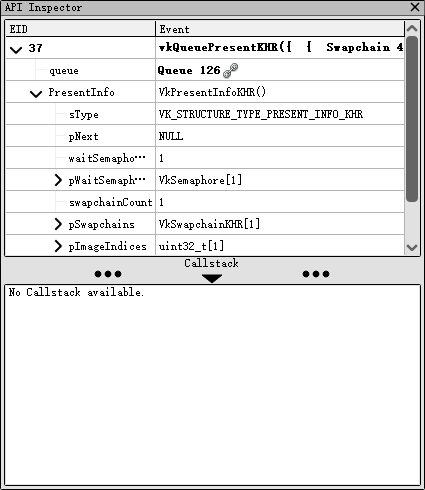

# API检视器

## API Calls
在这一部分中，列出了前一个操作和当前选定操作之间的一系列API调用。当前操作始终是此列表中的最后一个元素，并以粗体显示。默认情况下，它也是选定的元素。

每个API调用都可以展开查看传递给它的参数，以捕获时序列化的形式显示。

## Callstack
调用栈部分可以通过双击分隔线来展开或折叠。展开后，可以通过点击并拖动分隔线来调整其大小。

当调用栈尚未准备好显示时，该部分会显示“没有可用的调用栈”或“需要解析符号”。

调用栈会跟随当前选定的API调用进行更新，当选定的调用或当前事件发生变化时，它会同步更新（因为当前事件的改变会隐式地改变选定的API调用）。

