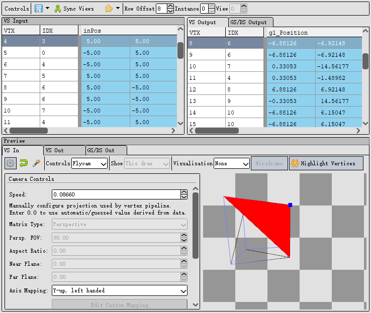
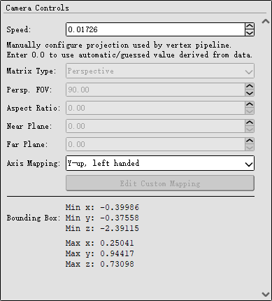

# 网格视窗

网格视窗不仅通过一种可视化的方法展示了不同阶段网格数据 ———— 顶点着色器之前，顶点着色器之后等等。通过在Event Browser或者在time bar上选择想要查看的实例。每个顶点都有一个显示，用于展示网格数据，其格式来源于渲染管线的相关阶段，如着色器输入或输出，或顶点输入属性。你可以选择Sync Views同步这些视图，并指定一个偏移量以保持一致，这样在不同事件之间移动时可以看到相同的行。在此下方是一个3D视图，该视图在任意时间只显示一个阶段，并可以通过上方的Row Offset标签进行切换。有两种控制方案用于查看3D网格：默认用于变换前（VS输入）的Arcball控制和默认用于变换后（VS输出）的Flycam控制。你可以随时通过网格视图上方工具栏的下拉菜单在这两者之间切换。那什么是Arcball和Flycam控制以及为什么前者默认用于VS输出，后者用于VS输入？

## Arcball 控制
Arcball控制方案通过旋转一个虚拟的球体来查看3D对象。鼠标拖动旋转球体，查看对象的不同角度。这种控制方案适合查看对象的局部细节和进行精细的旋转操作。
## Flycam 控制
Flycam控制方案模拟飞行中的摄像机，可以前后左右移动，旋转视角，并调整高度。类似于第一人称视角的控制。这种控制方案适合全局查看对象和在3D空间中自由导航。
 

* Arcball 用于 VS 输入：在顶点着色器输入阶段，顶点数据尚未变换，开发者需要精细查看每个顶点的位置和结构，Arcball控制能够更精确地旋转和查看这些未变换的顶点。
* Flycam 用于 VS 输出：在顶点着色器输出阶段，顶点数据已经过变换，Flycam控制可以在3D空间中自由导航，方便开发者查看变换后的整体效果和位置关系。
 

在Mesh View的中心部分也存在这一个toolbar， 我们从右向左开始讲起。位于toolbar最右端的为Highlight Vertices, 用于高亮显示特定条件下的顶点。这可以帮助开发者更直观地查看和分析网格数据中的问题或特定特性。
 

Wireframe（线框模式）位于Highlight Vertices左侧，该功能用于以线框形式显示3D网格。这种显示模式可以帮助开发者更清晰地查看和分析网格的结构、顶点连接和面片分布，便于发现和调试几何问题。
 

Visualisation（可视化）下拉框提供了多种选项，用于以不同的方式显示和分析网格数据。
* None： 不应用任何特殊的可视化效果。显示原始的网格数据，不进行额外的可视化处理。
* Solid Colour： 以单一颜色显示网格数据，通常用于显示每个面或每个顶点的颜色。帮助开发者直观地查看网格的颜色属性，分析和调试颜色分布。
* Flat Shaded： 使用平面着色显示网格数据，每个多边形面都用一个单一的颜色。用于查看和分析网格的几何形状和面法线方向，有助于识别面法线不一致或其他几何问题。
* Secondary： 显示次要属性，如纹理坐标、切线或副切线等。帮助开发者调试和分析次要属性，确保这些属性正确应用于网格。
* Exploded： 以分解视图显示网格数据，将网格的各个部分分离开来。用于查看和分析复杂网格的结构，识别和调试顶点和面之间的连接关系。
 

"Show" 下拉菜单提供了选项用于控制网格视图中显示的绘制调用（Draw Call）范围。具体选项有助于开发者更好地分析和调试特定范围内的网格数据。
* This Draw： 仅显示当前选定的绘制调用。详细调试单个绘制调用时使用。
* Previous Draws： 显示当前绘制调用及之前的所有绘制调用。分析绘制序列影响时使用。
* All Draws： 显示所有的绘制调用，包括当前和之前的所有绘制。综合分析所有绘制调用时使用。
* Wireframe： 在当前显示模式上叠加线框显示。几何结构分析时使用。
 

接下来就是三个按键，从右1往左分别是：auto-fit，reset和options。我们首先从auto-fit按键开始， 它会自动调整按钮棒会将相机调整到网格的轴对齐边界框。位于其左侧的是reset按钮，用于回撤上一步操作。最后一个是options选项，打开此选项，我可以指定投影矩阵中使用的 FOV。 如果您使用正交矩阵，则可以指定它 - 尽管这需要手动调整矩阵参数。

 

