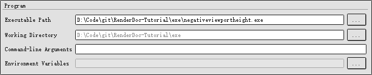
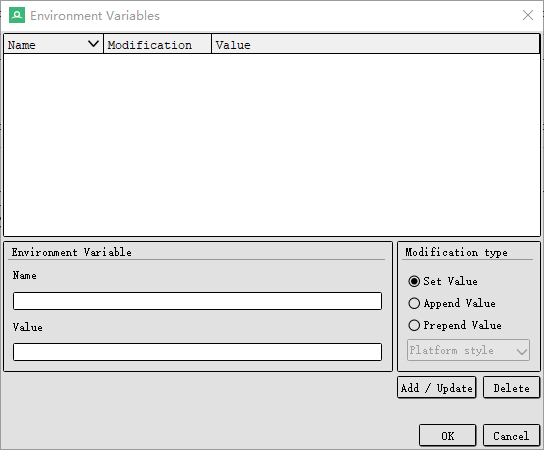
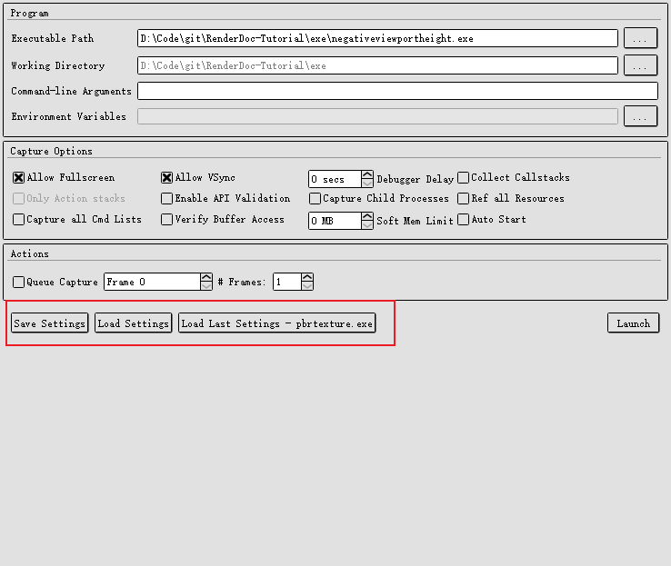

# 捕获对话

要捕获一个程序，你需要提供要启动的应用程序的详细信息，至少需要定位要运行的可执行文件。对话框的“Program”部分会提示你输入要启动的可执行文件、工作目录以及要传递给程序的任何命令行参数。它还允许你指定对环境变量进行的任何修改。可执行文件路径和工作目录旁边的“…”按钮可以用来浏览文件系统。如果你在远程环境中工作，那么文件和目录浏览器将被替换为浏览远程环境文件系统的浏览器。默认情况下，如果工作目录框为空，那么包含可执行文件的目录将被用作工作目录。环境变量行旁边的“…”按钮将打开一个编辑器，允许你指定在启动程序时对环境变量进行的任何更改。例如，这可以用于设置配置选项，或进行必要的设置以确保正确运行，如配置路径或设置DISPLAY变量。

 

在环境变量编辑器中，你可以选择要更改的变量名称以及要使用的值。然后，你可以选择要执行的操作。
* __Set（设置）__：将覆盖任何现有值或使用你指定的值创建变量。
* __Prepend Value（前置值）和Append Value（追加值）__：将你指定的值添加到现有变量的开头或末尾。如果变量不存在，将使用指定的值创建该变量。
 

在前置或追加值时，你还可以选择应用的分隔符，例如修改PATH变量时。你可以选择冒号（:）、分号（;）、平台样式（Windows上使用分号，其他平台上使用冒号），或者不使用分隔符。如果变量不存在，则不会添加分隔符；如果变量存在，分隔符会添加在现有值和你选择添加的值之间。
 

当你准备好进行捕获时，只需点击右下角的**Capture（捕获）**按钮。如果你希望保存这些特定的设置，可以点击Save Settings（保存设置）按钮，将它们保存到一个.cap文件中。这个.cap文件可以手动加载，或者通过File → Recent Captures菜单访问。如果.cap文件与RenderDoc关联，那么从这个文件启动RenderDoc时会自动加载捕获设置。如果勾选了Auto start（自动启动），双击.cap文件将立即使用给定的设置触发捕获。最后一次用于启动可执行文件的设置将自动保存，下次设置时，在Save Settings和Load Settings按钮旁边会有一个**Load Last Settings - Executable（加载上次设置 - 可执行文件）**按钮。这在你没有保存配置但想快速重新启动时非常有用。

 

## Capture Options
Capture Options（捕获选项）对话框中，提供了多种选项来控制捕获过程的行为和配置。以下是每个选项的详细说明：
* Allow Fullscreen（允许全屏）：允许在全屏模式下进行捕获。用于捕获在全屏模式下运行的应用程序。
* Allow VSync（允许垂直同步）：允许启用垂直同步。用于捕获启用了垂直同步的应用程序。
* Debugger Delay（调试器延迟）：设置在启动应用程序和开始捕获之间的延迟时间。在调试器附加到应用程序之前，给出一定的延迟时间。
* Collect Callstacks（收集调用栈）:在捕获过程中收集API调用的调用栈。用于调试和分析，提供更详细的上下文信息。
* Only Action stacks（仅动作栈）：仅收集特定动作的调用栈。减少收集的数据量，只关注重要的调用栈信息。
* Enable API Validation（启用API验证）：启用API验证，检查API调用的正确性。用于捕获和调试时验证API调用是否符合规范。
* Capture Child Processes（捕获子进程）：捕获由主进程创建的子进程。用于捕获多进程应用程序中的所有相关进程。
* Ref all Resources（引用所有资源）：引用捕获过程中使用的所有资源。确保在捕获文件中包含所有需要的资源，以便于后续分析。
* Capture all Cmd Lists（捕获所有命令列表）：捕获所有命令列表，而不仅仅是执行的命令。用于更详细地捕获和分析命令列表。
* Verify Buffer Access（验证缓冲区访问）：验证在捕获过程中对缓冲区的访问。用于调试缓冲区访问问题，确保访问的正确性。
* Soft Mem Limit（内存软限制）：设置捕获过程中使用的内存软限制。控制捕获过程中使用的内存量，防止内存过度使用。
* Auto Start（自动启动）：自动启动捕获过程。在启动应用程序时立即开始捕获，简化捕获过程。

